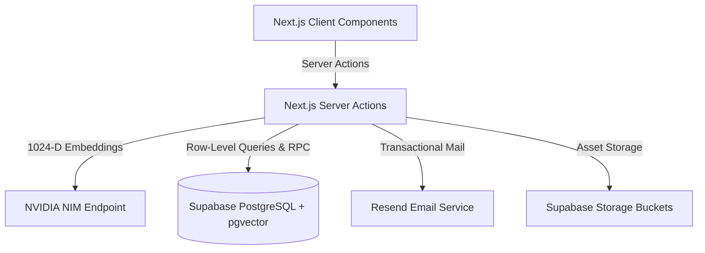
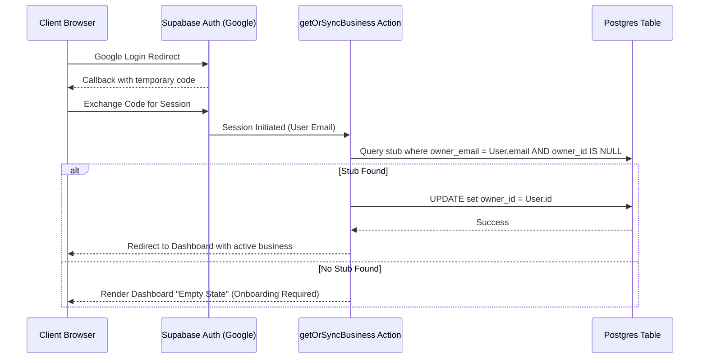

# Y's Men International (SWIR) - Backend Architecture & Technical Reference

This document provides an exhaustive, production-grade technical specification of the backend ecosystem powering the Y's Men International South West India Region (SWIR) Business Directory. It details the server-side architecture, PostgreSQL schemas, AI/vector pipeline mathematics, security rules, authentication flows, email systems, and storage buckets.

---

## 1. High-Level Backend Architecture

The directory relies on a secure split client-server backend model built around **Next.js 16 Server Actions**, **Supabase (PostgreSQL 15 + pgvector)**, **NVIDIA NIM Embedding Engine**, and **Resend Transactional Email**.



### Key Integration Points
*   **Database**: PostgreSQL 15 managed by Supabase, extended with `pgvector` for high-dimensional semantic vectors and full-text indexes.
*   **Identity**: Supabase Auth (Google OAuth 2.0).
*   **AI Engine**: NVIDIA NIM utilizing the `nvidia/nv-embedqa-e5-v5` model to generate dense vectors.
*   **SMTP Pipeline**: Resend API executing transactional HTML emails compiled via `@react-email/render`.

---

## 2. Core Database Schema & Data Models

### The `businesses` Table
The central data model representing a member's business listing. Stored in the public schema of PostgreSQL.

| Column Name | PostgreSQL Type | Nullable | Description / Constraints |
| :--- | :--- | :--- | :--- |
| `id` | `uuid` (PK) | NO | Auto-generated UUID. |
| `owner_id` | `uuid` (FK) | YES | Links to `auth.users` in Supabase Auth schema. |
| `owner_name` | `text` | YES | Full name of the business owner. |
| `owner_email` | `text` | YES | Private email address (protected by RLS, used for claiming stubs). |
| `contact_email` | `text` | YES | Public email address displayed on directory listings. |
| `contact_phone` | `text` | YES | Public business phone. |
| `owner_phone` | `text` | YES | Private owner phone number. |
| `brand_name` | `text` | YES | Official name of the business enterprise. |
| `category` | `text` | YES | Primary business sector classification (e.g. Technology). |
| `tagline` | `text` | YES | Short business slogan (max 100 characters). |
| `description` | `text` | YES | Substantial details about the company. |
| `services` | `jsonb` | YES | Flat JSON string array of expertise keywords: `["Web Dev", "Marketing"]`. |
| `special_offer` | `text` | YES | Promotion / discount exclusive to Y's Men members. |
| `address` | `text` | YES | Physical business address. |
| `city` | `text` | YES | City location (dynamic option list collector). |
| `state` | `text` | YES | State location. |
| `country` | `text` | YES | Country location (defaults to "India" on insert). |
| `logo_url` | `text` | YES | Supabase storage URL for the brand logo. |
| `primary_image_url` | `text` | YES | Banner image hosted in storage. |
| `gallery_urls` | `jsonb` | YES | JSON array of additional brand media paths. |
| `brochure_url` | `text` | YES | Supabase storage URL for uploaded PDF brochure. |
| `sponsorship_tier` | `integer`| YES | Placement weight and layout badges (null / integer). |
| `ym_region` | `text` | YES | Y's Men SWIR Region. |
| `ym_zone` | `text` | YES | Regional Zone designation. |
| `ym_district` | `text` | YES | Regional District code. |
| `ym_club` | `text` | YES | Local Y's Men's club affiliation. |
| `ym_designation` | `text` | YES | Leadership designation. |
| `imis_id` | `text` | YES | Official international ID (e.g. YMI-12345). |
| `embedding` | `vector(1024)` | YES | 1024-dimensional dense semantic vector. |

### Row-Level Security (RLS) Policies
RLS is strictly enforced on the `businesses` table to protect sensitive member data (PII) from scrapers:
*   **Anonymous Select (Public)**: Public clients can only access non-PII columns: `id`, `brand_name`, `category`, `description`, `services`, `special_offer`, `address`, `city`, `state`, `country`, `logo_url`, `primary_image_url`, `ym_club`, `website_url`, and `tagline`.
*   **Owner Access (Self)**: Users with a session whose `auth.uid() = owner_id` have full `SELECT`, `UPDATE`, and `DELETE` access to all columns including PII (`owner_email`, `owner_phone`, `imis_id`).
*   **Admin Bypass**: Admin synchronizers run using the Supabase `service_role` key, bypassing RLS to generate vectors and execute synchronization pipelines.

---

## 3. Search Mechanics & Vector Pipeline

### NVIDIA NIM Vector Generation
Whenever a profile is created or updated, the backend compiles metadata into a structured payload string for embedding:

```text
Company: [brand_name] | Location: [city], [state], [country] | Category: [category] | Description: [description] | Core Expertise: [comma-separated services]
```

This normalized string is sent to the NVIDIA NIM Embeddings API:
*   **Endpoint**: `https://integrate.api.nvidia.com/v1/embeddings`
*   **Model**: `nvidia/nv-embedqa-e5-v5`
*   **Payload Type**: `passage` for database updates; `query` for search queries.
*   **Dimensions**: `1024` floating-point dimensions.
*   **Fallback**: If the API call fails or times out, the search server action gracefully falls back to Postgres Full-Text Search (FTS) to avoid service interruptions.

### Reciprocal Rank Fusion (RRF) & SQL Logic
When a search keyword is entered, the server action fetches the embedding vector for the query and executes the `hybrid_search_businesses` PostgreSQL RPC function.

#### The Mathematical Formula
```math
\text{RRF Score} = \left(\frac{1}{60 + R_{\text{Semantic}}} \times 0.7\right) + \left(\frac{1}{60 + R_{\text{FTS}}} \times 0.3\right)
```
Where:
*   $k = 60$ is the smoothing constant.
*   $R_{\text{Semantic}}$ is the vector similarity rank (computed using Cosine Distance `1 - (embedding <=> query_embedding)`).
*   $R_{\text{FTS}}$ is the Full-Text Search rank (computed using english text token dictionaries and weighted priority elements: `brand_name` [Weight A = 1.0], `category` [Weight B = 0.4], `description` [Weight C = 0.2]).

#### Dynamic Relational Drop-off Filter
Rather than filtering results with a hardcoded static limit (which risks displaying zero results or complete noise), the server action dynamically calculates a relevance cutoff:
```math
\text{Score}_{\text{Minimum}} = \text{Score}_{\text{Top Match}} \times 0.50
```
Only listings scoring $\ge 50\%$ of the highest scoring match are kept.

#### Score Normalization
Since RRF scores yield small fractions, scores are normalized by multiplying by **61** (mapping the highest mathematical maximum back to a $0.0 \text{ to } 1.0$ percentage range) for presentation in the frontend UI.

> [!CAUTION]
> **Schema Signature Mismatch**:
> There is a documented mismatch between the database schema (`007_resize_vector_dimensions.sql`) and the application layer (`app/actions/search.ts`):
> *   **Database Function**: `hybrid_search_businesses(query_embedding vector(1024), query_text text, category_filter text, match_count int)` does **not** take a `location_filter` parameter.
> *   **TypeScript Server Action**: The `performHybridSearch` function in `search.ts` calls the RPC passing `location_filter: location`.
>
> If location filtering is needed within hybrid search, the database migration must be extended to introduce `location_filter` to the function signature and filter query results by `city` inside the PostgreSQL CTE.

---

## 4. Auth & Identity Systems



### Auto-Claim Engine (`getOrSyncBusiness.ts`)
1.  On successful login, the system queries the `businesses` table where `owner_id = user.id`.
2.  If not found, it runs an **Orphan Claim Lookup**: searches for a record where `owner_email = user.email` and `owner_id IS NULL` (pre-populated administrative stub).
3.  If a stub matches, the engine mutates the record by setting `owner_id = user.id`, instantly establishing secure ownership without administrative manual intervention.

### VIP Onboarding Verification
If no stub matches the Google email, users enter the VIP verification flow:
1.  The user provides their official **IMIS ID** and contact email.
2.  The server action cross-references active stubs.
3.  If verified, the ownership link `owner_id` is written to the record, granting full admin controls.

---

## 5. Storage Buckets & Media Constraints

Supabase Storage is utilized to host user-uploaded assets across two specific buckets:
*   **`logos`**: Contains company logos in web-optimized formats.
*   **`brochures`**: Contains PDF/image media profiles.

### File Security & Validation
Uploads are processed inside the client using Supabase SDK but validated during server-side onboarding handlers:
*   **Logo Size Limit**: Max **5MB**. Restricted strictly to image MIME types (`image/jpeg`, `image/png`, `image/webp`).
*   **Primary Banner Size Limit**: Max **5MB**. Restricted strictly to image MIME types.
*   **Brochure Size Limit**: Max **15MB**. Restricted strictly to standard PDF document formatting (`application/pdf`) and web image formats.
*   **Path Separation**: Files are placed inside user-specific directories to avoid conflicts: `[bucket]/[user_id]/[field]-[timestamp].[ext]`.

---

## 6. Email Pipeline & React 19 Compilers

The transaction pipeline uses **Resend API** to process customer leads and onboarding enrollment applications.

### Lead Emails (`sendLead.ts`)
*   **Action**: Captures lead inquiries from directory spotlight pages.
*   **Target Resolving**: Queries the `businesses` table to find `contact_email` (falling back to `owner_email`).
*   **Manual Rendering for React 19**: Standard Resend SDK invocation throws internal compiler errors (`render is not a function`) due to React 19 JSX changes. The backend resolves this by manually calling `@react-email/render` to build type-safe HTML template blocks before sending:
    ```typescript
    const htmlContent = await render(React.createElement(LeadEmail, {
      senderName: validatedData.name,
      senderEmail: validatedData.email,
      senderPhone: validatedData.phone,
      message: validatedData.message,
      businessName: business.brand_name,
    }));
    ```
*   **Dispatch**: Dispatches email from `leads@ymidirectory.com` and automatically BCCs `jayanand.jayakumar@gmail.com` for auditing.

### Enrollment Applications (`accessRequest.ts`)
*   **Action**: Handles non-member requests requesting admission.
*   **Service**: Relies on `Resend` to dispatch details to admin mailbox (`jayanand.jayakumar@gmail.com`).

---

## 7. Operational Actions & Admin Synchronization

### Vector Synchronizer (`sync.ts`)
Exposes a backend routine `syncAllVectors` utilizing the `SUPABASE_SERVICE_ROLE_KEY` to bypass Row-Level Security:
1.  Selects all businesses where `embedding IS NULL`.
2.  Iterates through the rows, compiles the structured semantic metadata string.
3.  Generates the `1024-D` vector via NVIDIA NIM.
4.  Updates the `embedding` column in PostgreSQL.

### Path Invalidation
To keep public listings up to date, the `updateBusiness` server action automatically invalidates Next.js router caches on:
*   `/directory` (updates listings immediately)
*   `/directory/[id]` (updates details view)
*   `/dashboard` (updates owner dashboard view)

---

## 8. Summary of Server Actions Directory

*   **`addBusiness.ts`**: Safely creates a business profile row, captures the generated database ID, triggers the AI vector generator, and updates the embedding.
*   **`updateBusiness.ts`**: Verifies authenticated session ownership of `businessId`, mutates active listing details, regenerates embeddings, and invalidates page caches.
*   **`search.ts`**: Entry point for directory queries. Triggers empty query category loads or coordinates NIM query embedding and `hybrid_search_businesses` database RPC execution.
*   **`getEmbedding.ts`**: Low-level HTTP payload handler communicating directly with the NVIDIA integrate pipeline.
*   **`getOrSyncBusiness.ts`**: Initial dashboard identity checker and orphan-binding auto-claim coordinator.
*   **`sync.ts`**: Administrative service-role synchronized utility for sweeping and embedding null vector rows.
*   **`sendLead.ts`**: Transactional contact mailer with React 19 engine compatibility patches.
*   **`accessRequest.ts`**: Non-member admin enrollment dispatch pipeline.

---

## 2026-06-03 Integration Audit Report

### 1. Identified Frontend-Backend Disconnects
- **MemberView.tsx Profile Editor**: Displays member profile information statically (Name, Email, Phone, Club) but completely lacks any Profile Editor form interface, inputs, or edit-toggle states. The UI cannot invoke profile modifications.
- **Dead Sidebar Navigation Links**:
  - **`/dashboard/leads`** ("Lead Center" for Business Owners): Renders as a dead link because no `app/dashboard/leads` directory or route page exists.
  - **`/dashboard/billing`** ("Billing" for Business Owners): Renders as a dead link because no `app/dashboard/billing` directory or route page exists.
  - **`/dashboard/referrals`** ("Referral Hub" for Members): Renders as a dead link because no `app/dashboard/referrals` directory or route page exists.
  - **`/dashboard/business`** ("My Business" for Business Owners): Renders as a dead link because the directory only exposes `app/dashboard/business/[id]/edit/page.tsx` and lacks a base index `/dashboard/business/page.tsx`.

### 2. Server Action Deficiencies
- **Missing Leads Fetch Action**: No Server Action is defined to retrieve, filter, or query customer lead notifications from the `analytics_events` table (or similar tables) to feed a "Lead Center" UI.
- **Unwired Profile Update Action**: The `updateProfile` Server Action is fully implemented in `app/actions/profiles.ts` but is completely unwired on the frontend because `MemberView.tsx` lacks the visual form component to invoke it.

### 3. Immediate Action Plan
1. **Refactor `MemberView.tsx`**:
   - Add state controls (`isEditing`, `setIsEditing`) and validation using standard schemas.
   - Build out the Profile Edit Form component with inputs for `full_name`, `phone`, and `club`.
   - Wire the form submission handler to the `updateProfile` Server Action in `app/actions/profiles.ts`.
2. **Create/Fix Dashboard Routes**:
   - **`app/dashboard/business/page.tsx`**: Implement a route that fetches the owner's active business profiles from Supabase and redirects them to the edit page (`/dashboard/business/[id]/edit`) or renders a portfolio list.
   - **`app/dashboard/leads/page.tsx`**: Create the page route and wire it to fetch lead analytics events (i.e. `event_type = 'referral'` or similar) for the owner's business.
   - **`app/dashboard/billing/page.tsx`**: Create a base user billing portal interface and subscription tier management page.
   - **`app/dashboard/referrals/page.tsx`**: Add a dedicated Referral Hub view displaying the member scoreboard, points breakdown, and invite templates.
