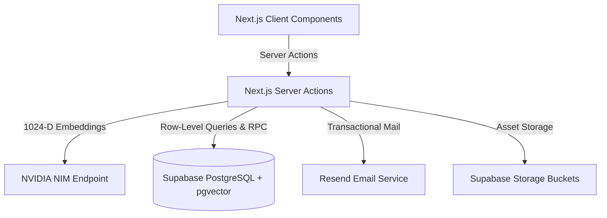

# Y's Men International (SWIR) - Backend Architecture & Technical Reference

This document provides an exhaustive, production-grade technical specification of the backend ecosystem powering the Y's Men International South West India Region (SWIR) Business Directory. It details the server-side architecture, PostgreSQL schemas, AI/vector pipeline mathematics, security rules, authentication flows, email systems, and storage buckets.

---

## 1. High-Level Backend Architecture

The directory relies on a secure split client-server backend model built around **Next.js 16 Server Actions**, **Supabase (PostgreSQL 15 + pgvector)**, **NVIDIA NIM Embedding Engine**, and **Resend Transactional Email**.



### Key Integration Points
*   **Database**: PostgreSQL 15 managed by Supabase, extended with `pgvector` for high-dimensional semantic vectors and full-text indexes.
*   **Identity**: Supabase Auth (Google OAuth 2.0).
*   **AI Engine**: NVIDIA NIM utilizing the `nvidia/nv-embedqa-e5-v5` model to generate dense vectors.
*   **SMTP Pipeline**: Resend API executing transactional HTML emails compiled via `@react-email/render`.
*   **Storage**: Supabase Storage buckets for logos, brochures, and showcase images.

---

## 2. Core Database Schema & Data Models

### The `businesses` Table
The central data model representing a member's business listing. Stored in the public schema of PostgreSQL.

| Column Name | PostgreSQL Type | Nullable | Description / Constraints |
| :--- | :--- | :--- | :--- |
| `id` | `uuid` (PK) | NO | Auto-generated UUID. |
| `owner_id` | `uuid` (FK) | YES | Links to `auth.users` in Supabase Auth schema. |
| `owner_name` | `text` | YES | Full name of the business owner. |
| `owner_email` | `text` | YES | Private email address (protected by RLS, used for claiming stubs). |
| `contact_email` | `text` | YES | Public email address displayed on directory listings. |
| `contact_phone` | `text` | YES | Public business phone. |
| `owner_phone` | `text` | YES | Private owner phone number. |
| `brand_name` | `text` | YES | Official name of the business enterprise. |
| `category` | `text` | YES | Primary business sector classification (e.g. Technology). |
| `tagline` | `text` | YES | Short business slogan (max 100 characters). |
| `description` | `text` | YES | Substantial details about the company. |
| `services` | `jsonb` | YES | Flat JSON string array of expertise keywords: `["Web Dev", "Marketing"]`. |
| `special_offer` | `text` | YES | Promotion / discount exclusive to Y's Men members. |
| `address` | `text` | YES | Physical business address. |
| `city` | `text` | YES | City location (dynamic option list collector). |
| `state` | `text` | YES | State location. |
| `country` | `text` | YES | Country location (defaults to "India" on insert). |
| `logo_url` | `text` | YES | Supabase storage URL for the brand logo. |
| `primary_image_url` | `text` | YES | Banner image hosted in storage. |
| `gallery_urls` | `jsonb` | YES | JSON array of additional brand media paths. |
| `brochure_url` | `text` | YES | Supabase storage URL for uploaded PDF brochure. |
| `sponsorship_tier` | `integer`| YES | Placement weight and layout badges (null / integer). |
| `ym_region` | `text` | YES | Y's Men SWIR Region. |
| `ym_zone` | `text` | YES | Regional Zone designation. |
| `ym_district` | `text` | YES | Regional District code. |
| `ym_club` | `text` | YES | Local Y's Men's club affiliation. |
| `ym_designation` | `text` | YES | Leadership designation. |
| `imis_id` | `text` | YES | Official international ID (e.g. YMI-12345). |
| `embedding` | `vector(1024)` | YES | 1024-dimensional dense semantic vector. |

### The `leads` Table
Created in Phase 8 to log customer contact inquiries locally for CRM tracking.

| Column Name | PostgreSQL Type | Nullable | Description / Constraints |
| :--- | :--- | :--- | :--- |
| `id` | `uuid` (PK) | NO | Auto-generated UUID. |
| `business_id` | `uuid` (FK) | NO | References `public.businesses(id)` with cascade deletes. |
| `sender_name` | `text` | NO | Customer name. |
| `sender_email` | `text` | NO | Customer email address. |
| `sender_phone` | `text` | YES | Optional customer contact phone. |
| `message` | `text` | NO | Detailed message body. |
| `created_at` | `timestamptz` | NO | Timestamp of creation (UTC). |

### The `ad_campaigns` Table
Updated in Phase 8 to support both Search Boosts and Homepage Banner Patrons.

| Column Name | PostgreSQL Type | Nullable | Description / Constraints |
| :--- | :--- | :--- | :--- |
| `id` | `uuid` (PK) | NO | Auto-generated UUID. |
| `business_id` | `uuid` (FK) | NO | References `public.businesses(id)` with cascade deletes. |
| `status` | `text` | NO | Campaign status check: `draft`, `pending`, `active`, `paused`, `expired`. |
| `campaign_type` | `text` | NO | Placements: `search_boost` or `homepage_patron` (default `search_boost`). |
| `boost_multiplier`| `float` | NO | Sorting boost power (defaults to `1.0`). |
| `start_date` | `timestamptz` | NO | Schedule start timestamp. |
| `end_date` | `timestamptz` | NO | Schedule expiration timestamp. |
| `payment_proof_url` | `text` | YES | Supabase Storage public URL for the payment proof screenshot. |
| `created_at` | `timestamptz` | NO | Record creation timestamp. |

---

## 3. Row-Level Security (RLS) Policies

### `businesses` RLS
*   **Anonymous Select (Public)**: Public clients can only access non-PII columns.
*   **Owner Access (Self)**: Users with a session whose `auth.uid() = owner_id` have full `SELECT`, `UPDATE`, and `DELETE` access to all columns.
*   **Admin Bypass**: Admin synchronizers run using the Supabase `service_role` key, bypassing RLS to generate vectors and execute synchronization pipelines.

### `leads` RLS
*   **Insert Leads**: Open to both anonymous visitors and logged-in members:
    ```sql
    CREATE POLICY insert_leads ON public.leads FOR INSERT TO anon, authenticated WITH CHECK (true);
    ```
*   **Select Leads**: Restricted to regional/super admins or the business owner whom the listing is associated with:
    ```sql
    CREATE POLICY select_leads ON public.leads FOR SELECT TO authenticated
    USING (
      public.get_my_role() IN ('super_admin'::app_role, 'region_admin'::app_role)
      OR EXISTS (
        SELECT 1 FROM public.businesses b
        WHERE b.id = business_id AND b.owner_id = auth.uid()
      )
    );
    ```

### `ad_campaigns` RLS
*   **Select Campaigns (Admins & Owners)**: Allows regional/super admins or the business owner associated with the campaign's business to SELECT campaign details.
*   **Select Campaigns (Public Patrons)**: Allows public anonymous and authenticated users to view active homepage patron campaigns:
    ```sql
    CREATE POLICY select_public_patron_ad_campaigns ON public.ad_campaigns 
        FOR SELECT 
        TO anon, authenticated
        USING (status = 'active' AND campaign_type = 'homepage_patron');
    ```
*   **Insert Campaigns (Owners Only)**: Allows listing owners to create ad campaigns for businesses they own (matching `owner_id = auth.uid()`).
*   **Update Campaigns (Admins & Owners in Draft)**: Admins can update any campaign status (to approve, pause, or expire them). Business owners can only modify campaigns while they are in the `'draft'` status.


---

## 4. Search Mechanics & Vector Pipeline

### NVIDIA NIM Vector Generation
Whenever a profile is created or updated, the backend compiles metadata into a structured payload string for embedding:
```text
Company: [brand_name] | Location: [city], [state], [country] | Category: [category] | Description: [description] | Core Expertise: [comma-separated services]
```
This normalized string is sent to the NVIDIA NIM Embeddings API:
*   **Endpoint**: `https://integrate.api.nvidia.com/v1/embeddings`
*   **Model**: `nvidia/nv-embedqa-e5-v5`
*   **Dimensions**: `1024` floating-point dimensions.
*   **Fallback**: Bypasses NIM and executes Postgres Full-Text Search (FTS) to avoid service interruptions.

### Reciprocal Rank Fusion (RRF) & SQL Logic
When a search keyword is entered, the server action fetches the embedding vector for the query and executes the `hybrid_search_businesses` PostgreSQL RPC function.

#### The Mathematical Formula
```math
\text{RRF Score} = \left(\frac{1}{60 + R_{\text{Semantic}}} \times 0.7\right) + \left(\frac{1}{60 + R_{\text{FTS}}} \times 0.3\right)
```
Where:
*   $k = 60$ is the smoothing constant.
*   $R_{\text{Semantic}}$ is the vector similarity rank (computed using Cosine Distance `1 - (embedding <=> query_embedding)`).
*   $R_{\text{FTS}}$ is the Full-Text Search rank.

#### Dynamic Relational Drop-off Filter
Rather than filtering results with a hardcoded static limit, the server action dynamically calculates a relevance cutoff:
```math
\text{Score}_{\text{Minimum}} = \text{Score}_{\text{Top Match}} \times 0.50
```
Only listings scoring $\ge 50\%$ of the highest scoring match are kept. Scores are normalized by multiplying by **61** for presentation in the frontend UI.

---

## 5. Auth & Identity Systems

### Auto-Claim Engine (`getOrSyncBusiness.ts`)
1.  On successful login, the system queries the `businesses` table where `owner_id = user.id`.
2.  If not found, it runs an **Orphan Claim Lookup**: searches for a record where `owner_email = user.email` and `owner_id IS NULL` (pre-populated administrative stub).
3.  If a stub matches, the engine mutates the record by setting `owner_id = user.id` and updates the profile's `app_role` to `business_owner` inside a transaction.

### VIP Onboarding Verification
If no stub matches the Google email, users enter the VIP verification flow:
1.  The user provides their official **IMIS ID** and contact email.
2.  The server action cross-references active stubs.
3.  If verified, the ownership link `owner_id` is written to the record, granting full admin controls.

---

## 6. Storage Buckets & Media Constraints

Supabase Storage is utilized to host user-uploaded assets across three specific buckets:
*   **`logos`**: Contains company logos in web-optimized formats (Max 5MB).
*   **`business-images`**: Primary showcase/cover images for business listings (Max 5MB).
*   **`brochures`**: PDF brochures containing additional brand media files (Max 15MB).

---

## 7. Email Pipeline & React 19 Compilers

The transaction pipeline uses **Resend API** to process customer leads and onboarding enrollment applications.

### Lead Emails & Database Logging (`sendLead.ts`)
*   **Action**: Captures lead inquiries from directory spotlight pages.
*   **Logging**: Before initiating mail delivery, the server action logs the inquiry data directly into the `public.leads` table. If the database insertion fails, the process is aborted, avoiding phantom email dispatches.
*   **Manual Rendering for React 19**: Calls `@react-email/render` to build HTML template blocks:
    ```typescript
    const htmlContent = await render(React.createElement(LeadEmail, {
      senderName: validatedData.name,
      senderEmail: validatedData.email,
      senderPhone: validatedData.phone,
      message: validatedData.message,
      businessName: business.brand_name,
    }));
    ```
*   **Dispatch**: Dispatches email from `leads@ymidirectory.com` and automatically BCCs `jayanand.jayakumar@gmail.com` for auditing.

---

## 8. Summary of Server Actions Directory

*   **`addBusiness.ts`**: Safely creates a business profile row, captures the generated database ID, triggers the AI vector generator, and updates the embedding.
*   **`updateBusiness.ts`**: Verifies authenticated session ownership of `businessId`, mutates active listing details, regenerates embeddings, and invalidates page caches.
*   **`adCampaigns.ts`**: Handles creation, approval, and pausing of ad campaigns. Accepts `campaignType` parameter and maps it to the database table.
*   **`campaigns.ts`**: Houses public fetches like `getActivePatrons` to hydrate homepage grids.
*   **`search.ts`**: Entry point for directory queries. Triggers empty query category loads or coordinates NIM query embedding and `hybrid_search_businesses` database RPC execution.
*   **`getEmbedding.ts`**: Low-level HTTP payload handler communicating directly with the NVIDIA integrate pipeline.
*   **`getOrSyncBusiness.ts`**: Initial dashboard identity checker and orphan-binding auto-claim coordinator.
*   **`sync.ts`**: Administrative service-role synchronized utility for sweeping and embedding null vector rows.
*   **`sendLead.ts`**: Transactional contact mailer that stores customer data in `leads` table before rendering HTML templates and dispatching via Resend.
*   **`accessRequest.ts`**: Non-member admin enrollment dispatch pipeline.
