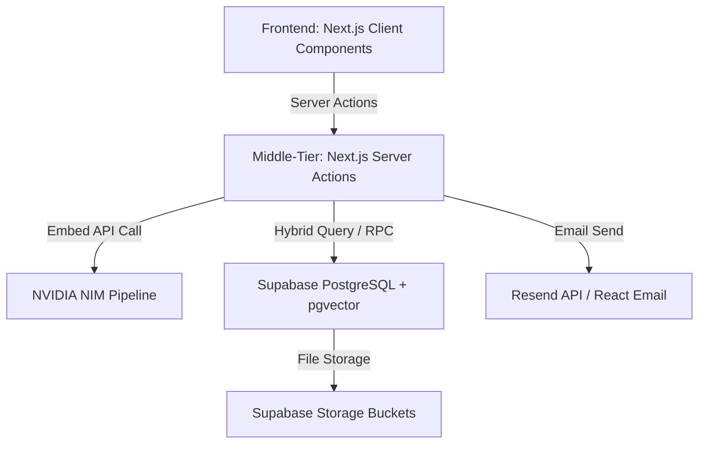
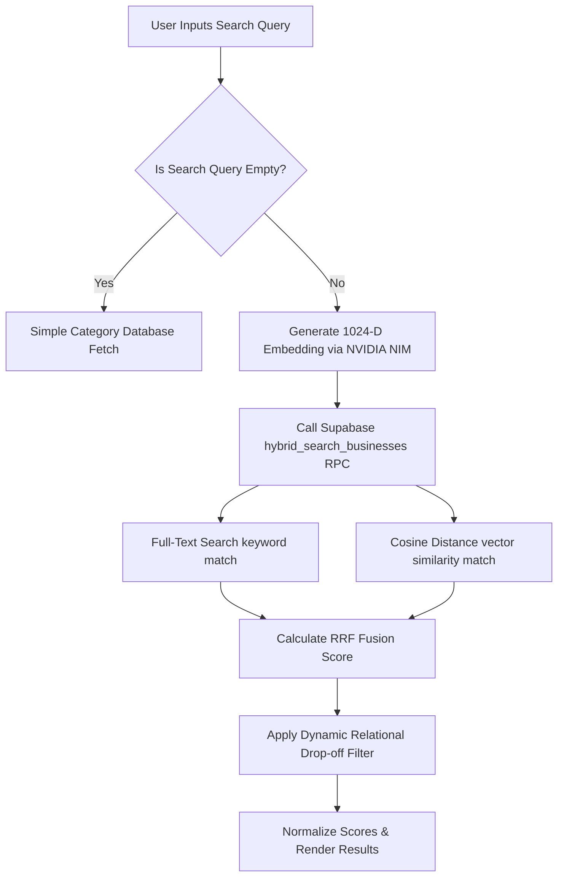

# Y's Men International (SWIR) - Comprehensive Technical Documentation

This document provides a highly comprehensive, production-grade technical breakdown of the Y's Men International South West India Region (SWIR) Business Directory and Regional Hub website. It details the complete architecture, tech stack, database schemas, AI-driven hybrid search pipeline, security controls, dynamic page designs, partner tooling, monetization features, and search engine optimization (SEO) configurations.

---

## 1. High-Level Architecture & Tech Stack

The application is built on a modern, modern-aesthetic framework utilizing a split client-server model in Next.js. It achieves maximum visual impact through curated animations and micro-interactions, backed by secure, high-performance database queries, attribution analytics, and AI semantic search.



### Core Technologies
*   **Frontend Framework**: **Next.js 16 (App Router)** & **React 19**
    *   Leverages React Server Components (RSC) for initial page fetching to ensure instant indexing by web crawlers.
    *   Uses client-side templates and page wrappers with Framer Motion for premium route transitions.
*   **Styling & Motion**: **Tailwind CSS 4** & **Framer Motion 12**
    *   Dark slate & navy palettes accented by high-contrast crimson elements for a premium, international NGO aesthetic.
    *   Features glassmorphic effects (`backdrop-blur-md`), parallax sections, and stagger-animated grids.
*   **Database & Backend**: **Supabase (PostgreSQL 15+)**
    *   Enables **pgvector** extensions for high-dimensional semantic search vectors.
    *   Implements secure **Row-Level Security (RLS)** to protect member PII (emails, phone numbers).
    *   Leverages **Supabase Storage** for hosting brand logos, primary business banner images, and downloadable PDF brochures.
*   **AI Embedding Engine**: **NVIDIA NIM (nvidia/nv-embedqa-e5-v5)**
    *   Generates highly dense **1024-dimensional vector embeddings** for semantic text queries.
*   **Email Pipeline**: **Resend API**
    *   Uses `@react-email/render` to build type-safe, beautifully formatted HTML transactional emails for lead enquiries and access requests.

---

## 2. Core Database Schema & Data Models

### The `profiles` Table
Normalized user accounts automatically synchronized with Supabase Auth.

| Column Name | PostgreSQL Type | Description |
| :--- | :--- | :--- |
| `id` | `uuid` (PK) | Unique identifier for the profile. |
| `user_id` | `uuid` (FK, Unique) | Links to the `auth.users` table in the Supabase auth schema. |
| `full_name` | `text` | Full name of the user. |
| `email` | `text` (Unique) | User email address. |
| `phone` | `text` | Contact phone number. |
| `club` | `text` | Y's Men Club affiliation. |
| `app_role` | `app_role` | Enum: `super_admin`, `region_admin`, `business_owner`, `member`. |
| `created_at` | `timestamptz` | Date of profile creation. |

### The `businesses` Table
The primary domain model is the `businesses` table. It holds all record details, verification fields, region parameters, and vector embeddings. Under the 1-to-Many architecture, multiple businesses can reference the same owner profile.

| Column Name | PostgreSQL Type | Description |
| :--- | :--- | :--- |
| `id` | `uuid` (PK) | Unique identifier for each business profile. |
| `owner_id` | `uuid` (FK) | Links to the `auth.users` table in the Supabase auth schema. |
| `owner_profile_id` | `uuid` (FK) | Links to the `public.profiles` table. |
| `owner_name` | `text` | The full name of the business owner. |
| `owner_email` | `text` | Private email for claiming matching (protected by RLS). |
| `contact_email` | `text` | Public contact email for business lead inquiries. |
| `contact_phone` | `text` | Public business phone. |
| `owner_phone` | `text` | Private owner contact phone. |
| `brand_name` | `text` | The official business brand/company name. |
| `category` | `text` | Business classification (e.g., Technology, Retail). |
| `description` | `text` | Detailed business description. |
| `services` | `jsonb` | A JSON array of specific services and expertise keywords. |
| `special_offer` | `text` | Member-only promotion details. |
| `address` | `text` | Physical office or storefront address. |
| `tagline` | `text` | Brief brand slogan. |
| `website_url` | `text` | External company website URL. |
| `logo_url` | `text` | Link to the logo file in the Supabase media bucket. |
| `primary_image_url` | `text` | Link to the main banner image in storage. |
| `gallery_urls` | `jsonb` | A JSON array of additional media gallery paths. |
| `sponsorship_tier`| `integer` | Controls directory page placement and layout badges. |
| `ym_region` | `text` | Y's Men SWIR Region (e.g., SWIR). |
| `ym_zone` | `text` | Regional Zone designation. |
| `ym_district` | `text` | Regional District code. |
| `ym_club` | `text` | Local Y's Men's club affiliation. |
| `ym_designation` | `text` | Official leadership role within Y's Men. |
| `imis_id` | `text` | Member's official international ID (e.g., YMI-12345). |
| `embedding` | `vector(1024)` | 1024-dimensional dense vector representing the brand text. |
| `brochure_url` | `text` | Link to the uploaded PDF brochure. |

### The `leads` Table
Created in Phase 8 to act as the core database store for initial directory spotlights inquiries before they are dispatched via email.

| Column Name | PostgreSQL Type | Description |
| :--- | :--- | :--- |
| `id` | `uuid` (PK) | Auto-generated UUID. |
| `business_id` | `uuid` (FK) | Links to the `public.businesses` listing. |
| `sender_name` | `text` | Name of the customer submitting the inquiry. |
| `sender_email` | `text` | Email address of the customer. |
| `sender_phone` | `text` | Contact phone number of the customer. |
| `message` | `text` | Text body of the customer inquiry. |
| `created_at` | `timestamp with time zone` | Timestamp when the lead was stored (UTC). |

### The `ad_campaigns` Table
Created in Phase 1 and updated in Phase 8 to support both Search Boosts and Homepage Patron placements.

| Column Name | PostgreSQL Type | Description |
| :--- | :--- | :--- |
| `id` | `uuid` (PK) | Auto-generated UUID. |
| `business_id` | `uuid` (FK) | Links to the target business listing. |
| `status` | `text` (Check constraint) | Status: `draft`, `pending`, `active`, `paused`, `expired`. |
| `campaign_type` | `text` (Check constraint)| Type: `search_boost` or `homepage_patron` (default `search_boost`). |
| `boost_multiplier`| `float` | Sorting boost factor (defaults to `1.0`; minimum `1.1` for search boosts). |
| `start_date` | `timestamp with time zone` | Start date of active promotion. |
| `end_date` | `timestamp with time zone` | Expiration date of promotion. |
| `payment_proof_url` | `text` | Supabase Storage public URL for the payment proof screenshot. |
| `created_at` | `timestamp with time zone` | Record creation timestamp. |

---

## 3. Row-Level Security (RLS) Rules

To protect member privacy, RLS policies are strictly enforced across tables:

### `profiles` Table RLS
*   **Select Profiles**: Users can only query their own profiles unless they are database admins, `super_admin`, or `region_admin`, who can view all profiles.
*   **Update Profiles**: Users can only update their own profiles (`auth.uid() = user_id`).

### `businesses` Table RLS
*   **Anonymous Select**: Allowed only for public columns (`brand_name`, `category`, `description`, `services`, `special_offer`, `logo_url`, `primary_image_url`, `ym_club`). Public users *cannot* access owner PII columns.
*   **Authenticated Select (Self)**: Users can query all fields (including PII) of rows matching `owner_id = auth.uid()`.
*   **Authenticated Update**: Allowed only if the user's `auth.uid()` matches the `owner_id` of the record, preventing unauthorized editing of directory listings.

### `leads` Table RLS
*   **Insert Leads (Anonymous / Authenticated)**: Allows visitors (anonymous) and members to submit contact inquiries on spotlight listings:
    ```sql
    CREATE POLICY insert_leads ON public.leads FOR INSERT TO anon, authenticated WITH CHECK (true);
    ```
*   **Select Leads (Authenticated Owner / Admin Bypass)**: Restricted strictly to database admins or the business owner whom the lead is scoped to:
    ```sql
    CREATE POLICY select_leads ON public.leads FOR SELECT TO authenticated
    USING (
      public.get_my_role() IN ('super_admin'::app_role, 'region_admin'::app_role)
      OR EXISTS (
        SELECT 1 FROM public.businesses b
        WHERE b.id = business_id AND b.owner_id = auth.uid()
      )
    );
    ```

### `ad_campaigns` Table RLS
*   **Select Campaigns**: Admins and the listing owner can read campaign details. Public anonymous visitors and authenticated users can SELECT active campaigns of type `homepage_patron`.
*   **Insert Campaigns**: Listing owners can create campaign drafts.
*   **Update Campaigns**: Admins can update any campaign status. Listing owners can only update campaigns if they are in `'draft'` status.

---

## 4. The Hybrid Search & Semantic Vector Pipeline

The YMI Directory features a highly advanced **Hybrid Search Pipeline** that fuses keyword matches with AI semantic intent matches using **Reciprocal Rank Fusion (RRF)**.



### The `hybrid_search_businesses` PostgreSQL RPC Signature
Below is the RPC signature defined in `007_resize_vector_dimensions.sql`:
```sql
CREATE OR REPLACE FUNCTION hybrid_search_businesses(
  query_embedding vector(1024),          -- Deployed 1024-D vector type
  query_text text,                       -- Search keywords
  category_filter text default null,     -- Category dropdown pivot
  match_count int default 20             -- Search limit
)
returns table (
  id uuid,
  owner_id uuid,
  owner_name text,
  contact_email text,
  contact_phone text,
  owner_phone text,
  brand_name text,
  category text,
  description text,
  services jsonb,
  special_offer text,
  address text,
  tagline text,
  website_url text,
  logo_url text,
  primary_image_url text,
  gallery_urls jsonb,
  sponsorship_tier integer,
  ym_region text,
  ym_club text,
  ym_designation text,
  embedding vector(1024),
  final_score float
)
language sql stable
as $$
  with filtered_businesses as (
    select *
    from businesses
    where (category_filter is null or category_filter = 'All' or category = category_filter)
  ),
  vector_matches as (
    select id, 1 - (embedding <=> query_embedding) as vector_similarity,
           rank() over (order by embedding <=> query_embedding) as rank
    from filtered_businesses
    where embedding is not null
  ),
  text_matches as (
    select id, ts_rank(
      setweight(to_tsvector('english', coalesce(brand_name, '')), 'A') ||
      setweight(to_tsvector('english', coalesce(category, '')), 'B') ||
      setweight(to_tsvector('english', coalesce(description, '')), 'C'),
      websearch_to_tsquery('english', query_text)
    ) as text_score,
    rank() over (order by ts_rank(
      setweight(to_tsvector('english', coalesce(brand_name, '')), 'A') ||
      setweight(to_tsvector('english', coalesce(category, '')), 'B') ||
      setweight(to_tsvector('english', coalesce(description, '')), 'C'),
      websearch_to_tsquery('english', query_text)
    ) desc) as rank
    from filtered_businesses
    where query_text <> '' and websearch_to_tsquery('english', query_text) @@ (
      setweight(to_tsvector('english', coalesce(brand_name, '')), 'A') ||
      setweight(to_tsvector('english', coalesce(category, '')), 'B') ||
      setweight(to_tsvector('english', coalesce(description, '')), 'C')
    )
  )
  select
    b.*,
    -- Reciprocal Rank Fusion (RRF) with weights (70% Vector / 30% Text)
    (coalesce(1.0 / (60 + v.rank), 0.0) * 0.7) + (coalesce(1.0 / (60 + t.rank), 0.0) * 0.3) as final_score
  from businesses b
  left join vector_matches v on v.id = b.id
  left join text_matches t on t.id = b.id
  where v.id is not null or t.id is not null
  order by final_score desc
  limit match_count;
$$;
```

---

## 5. Detailed Route Directory

### Public Routes
*   **Homepage (`/`)**:
    *   *Features*: Rich hero animation, parallax scroll banner containing the official Y's Men motto, staggered stats grid showcasing international presence, legacy navigation.
    *   *Monetization Showcase*: Mounts the dynamic `<EsteemedPatronsGrid />` component. This fetches all active homepage patron campaigns via `getActivePatrons` server action and displays their logos, linking them directly to their external websites in a clean, animated layout.
*   **History Page (`/about/history`)**:
    *   *Features*: A detailed vertical chronological timeline tracing the Y's Men legacy from Toledo, Ohio in 1922, through the Ceylon/India Area expansion, to the centennial jubilee and modern digital leap.
*   **Philosophy Page (`/about/philosophy`)**:
    *   *Features*: Premium multi-panel cards presenting the core pillars: **Duty**, **Service**, **Fellowship**, and **International Peace**. Hovering over cards triggers seamless color-inverting transitions.
*   **Marketplace Directory (`/directory`)**:
    *   *Features*: Serves as the central hub of search. Catches dynamic `?ref=UUID` search query parameters in the URL, generating a click record in `analytics_events` of type `'referral'` associated with the referring member's profile ID. Category and city dropdown elements are fully dynamic.
    *   *Directory Automatic Fallback Workflow*: If a category filter or location filter is active and the search query returns `0` results, it automatically resets the category filter state back to `'All'` and triggers a fallback query across the entire database directory, displaying a warning banner.
*   **Spotlight Detail Page (`/directory/[id]`)**:
    *   *Features*: A premium business profile featuring interactive slide-out inquiry forms, gallery layouts, and a sticky contact sidebar. When a contact form is submitted, the server action `sendLead` stores the message payload directly in the `leads` table before dispatching the email via Resend.
*   **Regional Leadership Directory (`/region/leadership`)**: Cabinet roles and district leader profiles.
*   **Regional Calendar (`/region/calendar`)**: Schedule of Regional and Area programs.
*   **Auth Error Page (`/auth/auth-error`)**:
    *   *Features*: Catches authentication issues or database trigger failures. Parses URL `searchParams` (`error` or `error_description`) to display a branded warning card with helpful instructions regarding Google logins and IMIS ID bindings, alongside CTAs to retry or return home.

### Private & Dashboard Routes
*   **Dashboard (`/dashboard`)**:
    *   *Features*: A secure interface displaying the logged-in user's active business profile. Showcases verification status, profile completeness stats, and quick actions to edit profiles.
*   **Onboarding Form (`/dashboard/onboarding`)**: Handles multi-field details and file uploads (logo, banner, brochure) to Supabase Storage, regenerating search embeddings automatically.
*   **Leads CRM Inbox (`/dashboard/leads`)**:
    *   *Features*: A unified Lead Center Inbox UI for business owners. Fetches leads associated with the owner's active listings and displays them in a clean, glassmorphic list-detail split viewport to track incoming customer requests.
*   **Referrals Scoreboard Hub (`/dashboard/referrals`)**:
    *   *Features*: Visual scorecard displaying total verified referrals driven by the logged-in member. Provides a quick link copy button (`/directory?ref=MEMBER_ID`) to share listings on WhatsApp/email.
*   **Owner Analytics Portal (`/dashboard/analytics?view=owner`)**:
    *   *Features*: Renders overview cards for Showcase Views and Member Referrals. Contains a 7-day attribution line chart and a **Top Referrers Leaderboard** listing other Y's Men members who have driven clicks to the owner's listings.
*   **Promotions Visbility Portal (`/dashboard/promotions`)**:
    *   *Features*: Allows listing owners to request new sponsorships. Users select between a Search Boost (`search_boost`) or a Homepage Patron Spotlight (`homepage_patron`). If they select Patron Spotlight, it dynamically checks if their listing has a logo image and a website URL, disabling submissions if incomplete.

---

## 6. Authentication, Closed-Claiming, & VIP Onboarding Flow

To keep the ecosystem exclusive and verified, the directory relies on a **Closed-Claiming** system. Members are pre-populated via verified administration lists.

### The Auto-Claim Engine (`getOrSyncBusiness.ts`)
When a member logs in using Google OAuth, the system automatically checks if they are a pre-registered Y's Men business owner:
1.  It queries the `businesses` table for any row containing an `owner_email` that matches the logged-in user's Google Email **and** where `owner_id` is currently `null` (unclaimed stub).
2.  If a stub is matched, the engine triggers a transaction:
    *   Updates the business by setting `owner_id = user.id`.
    *   Updates the profile by setting the user's `app_role = 'business_owner'`.
3.  This securely binds the business profile to that user without requiring manual admin verification.

---

## 7. SEO, Sitemap, & Google Search Console Architecture

The site implements high-level search engine optimizations to ensure search snippets look premium and index quickly on Google.

### Sitemap & Crawler Configuration (`app/sitemap.ts`)
We utilize Next.js's dynamic sitemap builder which outputs a standard XML sitemap at `/sitemap.xml`.
*   **Dynamic Profiles Indexing**: The sitemap query fetches the IDs of all active businesses anonymously without cookie context, allowing the sitemap to compile perfectly as a pre-rendered static route with a 1-hour cache revalidation.
*   **Indexation Rules (`app/robots.ts`)**: Disallows crawling on administrative paths (`/dashboard`, `/auth`, `/actions`).
*   **JSON-LD Structured Data**: Injects Organization and WebSite schema graphs in the root layout metadata header for search snippet optimizations.

---

## 8. Summary of Server Actions Directory

*   **`addBusiness.ts`**: Safely creates a business profile row, captures the generated database ID, triggers the AI vector generator, and updates the embedding.
*   **`updateBusiness.ts`**: Verifies authenticated session ownership of `businessId`, mutates active listing details, regenerates embeddings, and invalidates page caches.
*   **`deleteBusiness.ts`**: Verifies authenticated session ownership and securely deletes the business listing.
*   **`adCampaigns.ts`**: Handles creation, approval, and pausing of ad campaigns. Accepts `campaignType` parameter and maps it to the database table.
*   **`campaigns.ts`**: Houses public fetches like `getActivePatrons` to hydrate homepage grids.
*   **`search.ts`**: Entry point for directory queries. Triggers empty query category loads or coordinates NIM query embedding and `hybrid_search_businesses` database RPC execution.
*   **`getEmbedding.ts`**: Low-level HTTP payload handler communicating directly with the NVIDIA integrate pipeline.
*   **`getOrSyncBusiness.ts`**: Initial dashboard identity checker and orphan-binding auto-claim coordinator.
*   **`sync.ts`**: Administrative service-role synchronized utility for sweeping and embedding null vector rows.
*   **`sendLead.ts`**: Transactional contact mailer that stores customer data in `leads` table before rendering HTML templates and dispatching via Resend.
*   **`accessRequest.ts`**: Non-member admin enrollment dispatch pipeline.
*   **`profiles.ts`**: Manages user profile retrieval, updating basic settings, and elevations from `member` to `business_owner`.
*   **`logAnalyticsEvent.ts`**: Registers user views or member referrals asynchronously.
