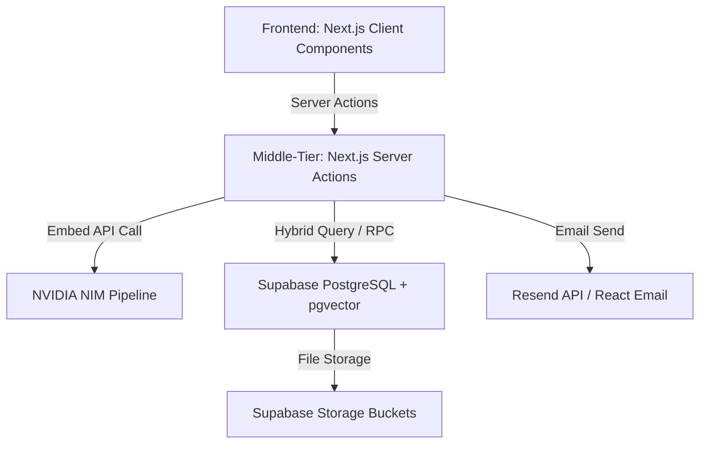
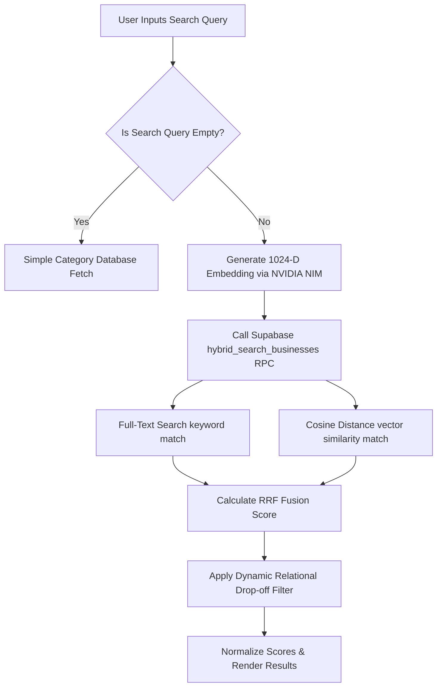

# Y's Men International (SWIR) - Comprehensive Technical Documentation

This document provides a highly comprehensive, production-grade technical breakdown of the Y's Men International South West India Region (SWIR) Business Directory and Regional Hub website. It details the complete architecture, tech stack, database schemas, AI-driven hybrid search pipeline, security controls, dynamic page designs, and search engine optimization (SEO) configurations.

---

## 1. High-Level Architecture & Tech Stack

The application is built on a modern, modern-aesthetic framework utilizing a split client-server model in Next.js. It achieves maximum visual impact through curated animations and micro-interactions, backed by secure, high-performance database queries and AI semantic search.



### Core Technologies
*   **Frontend Framework**: **Next.js 16 (App Router)** & **React 19**
    *   Leverages React Server Components (RSC) for initial page fetching to ensure instant indexing by web crawlers.
    *   Uses client-side templates and page wrappers with Framer Motion for premium route transitions.
*   **Styling & Motion**: **Tailwind CSS 4** & **Framer Motion 12**
    *   Dark slate & navy palettes accented by high-contrast crimson elements for a premium, international NGO aesthetic.
    *   Features glassmorphic effects (`backdrop-blur-md`), parallax sections, and stagger-animated grids.
*   **Database & Backend**: **Supabase (PostgreSQL 15+)**
    *   Enables **pgvector** extensions for high-dimensional semantic search vectors.
    *   Implements secure **Row-Level Security (RLS)** to protect member PII (emails, phone numbers).
    *   Leverages **Supabase Storage** for hosting brand logos, primary business banner images, and downloadable PDF brochures.
*   **AI Embedding Engine**: **NVIDIA NIM (nvidia/nv-embedqa-e5-v5)**
    *   Generates highly dense **1024-dimensional vector embeddings** for semantic text queries.
*   **Email Pipeline**: **Resend API**
    *   Uses `@react-email/render` to build type-safe, beautifully formatted HTML transactional emails for lead enquiries and access requests.

---

## 2. Core Database Schema & Data Models

### The `businesses` Table
The primary domain model is the `businesses` table. It holds all record details, verification fields, region parameters, and vector embeddings.

| Column Name | PostgreSQL Type | Description |
| :--- | :--- | :--- |
| `id` | `uuid` (PK) | Unique identifier for each business profile. |
| `owner_id` | `uuid` (FK) | Links to the `auth.users` table in the Supabase auth schema. |
| `owner_name` | `text` | The full name of the business owner. |
| `owner_email` | `text` | Private email for claiming matching (protected by RLS). |
| `contact_email` | `text` | Public contact email for business lead inquiries. |
| `contact_phone` | `text` | Public business phone. |
| `owner_phone` | `text` | Private owner contact phone. |
| `brand_name` | `text` | The official business brand/company name. |
| `category` | `text` | Business classification (e.g., Technology, Retail). |
| `description` | `text` | Detailed business description. |
| `services` | `jsonb` | A JSON array of specific services and expertise keywords. |
| `special_offer` | `text` | Member-only promotion details. |
| `address` | `text` | Physical office or storefront address. |
| `tagline` | `text` | Brief brand slogan. |
| `website_url` | `text` | External company website URL. |
| `logo_url` | `text` | Link to the logo file in the Supabase media bucket. |
| `primary_image_url` | `text` | Link to the main banner image in storage. |
| `gallery_urls` | `jsonb` | A JSON array of additional media gallery paths. |
| `sponsorship_tier`| `integer` | Controls directory page placement and layout badges. |
| `ym_region` | `text` | Y's Men SWIR Region (e.g., SWIR). |
| `ym_zone` | `text` | Regional Zone designation. |
| `ym_district` | `text` | Regional District code. |
| `ym_club` | `text` | Local Y's Men's club affiliation. |
| `ym_designation` | `text` | Official leadership role within Y's Men. |
| `imis_id` | `text` | Member's official international ID (e.g., YMI-12345). |
| `embedding` | `vector(1024)` | 1024-dimensional dense vector representing the brand text. |
| `brochure_url` | `text` | Link to the uploaded PDF brochure. |

### Row-Level Security (RLS) Rules
To protect member privacy, RLS policies are strictly enforced:
*   **Anonymous Select**: Allowed only for public columns (`brand_name`, `category`, `description`, `services`, `special_offer`, `logo_url`, `primary_image_url`, `ym_club`). Public users *cannot* access owner PII columns.
*   **Authenticated Select (Self)**: Users can query all fields (including PII) of rows matching `owner_id = auth.uid()`.
*   **Authenticated Update**: Allowed only if the user's `auth.uid()` matches the `owner_id` of the record, preventing unauthorized editing of directory listings.

### The `hybrid_search_businesses` PostgreSQL RPC Signature
To perform reciprocal rank fusion hybrid searches, we define the following secure RPC signature in the PostgreSQL database, executing text-search indexing and dense `pgvector` Cosine Distance math securely on the database side with no hardcoded similarity threshold gates:

```sql
CREATE OR REPLACE FUNCTION hybrid_search_businesses(
  query_embedding vector(1024),          -- Deployed 1024-D vector type
  query_text text,                       -- Search keywords
  category_filter text default null,     -- Category dropdown pivot
  location_filter text default null,     -- City dropdown filter
  match_count int default 20             -- Search limit
)
returns table (
  id uuid,
  owner_id uuid,
  owner_name text,
  contact_email text,
  contact_phone text,
  owner_phone text,
  brand_name text,
  category text,
  description text,
  services jsonb,
  special_offer text,
  address text,
  tagline text,
  website_url text,
  logo_url text,
  primary_image_url text,
  gallery_urls jsonb,
  sponsorship_tier integer,
  ym_region text,
  ym_club text,
  ym_designation text,
  embedding vector(1024),
  final_score float
)
language sql stable
as $$
  with filtered_businesses as (
    select *
    from businesses
    where (category_filter is null or category_filter = 'All' or category = category_filter)
      and (location_filter is null or location_filter = 'All' or city = location_filter)
  ),
  vector_matches as (
    select id, 1 - (embedding <=> query_embedding) as vector_similarity,
           rank() over (order by embedding <=> query_embedding) as rank
    from filtered_businesses
    where embedding is not null
  ),
  text_matches as (
    select id, ts_rank(
      setweight(to_tsvector('english', coalesce(brand_name, '')), 'A') ||
      setweight(to_tsvector('english', coalesce(category, '')), 'B') ||
      setweight(to_tsvector('english', coalesce(description, '')), 'C'),
      websearch_to_tsquery('english', query_text)
    ) as text_score,
    rank() over (order by ts_rank(
      setweight(to_tsvector('english', coalesce(brand_name, '')), 'A') ||
      setweight(to_tsvector('english', coalesce(category, '')), 'B') ||
      setweight(to_tsvector('english', coalesce(description, '')), 'C'),
      websearch_to_tsquery('english', query_text)
    ) desc) as rank
    from filtered_businesses
    where query_text <> '' and websearch_to_tsquery('english', query_text) @@ (
      setweight(to_tsvector('english', coalesce(brand_name, '')), 'A') ||
      setweight(to_tsvector('english', coalesce(category, '')), 'B') ||
      setweight(to_tsvector('english', coalesce(description, '')), 'C')
    )
  )
  select
    b.*,
    -- Reciprocal Rank Fusion (RRF) with weights (70% Vector / 30% Text)
    (coalesce(1.0 / (60 + v.rank), 0.0) * 0.7) + (coalesce(1.0 / (60 + t.rank), 0.0) * 0.3) as final_score
  from businesses b
  left join vector_matches v on v.id = b.id
  left join text_matches t on t.id = b.id
  where v.id is not null or t.id is not null
  order by final_score desc
  limit match_count;
$$;
```

### Data Structure & Validation Constraints
*   **`services` Column Schema**: Stored within Supabase `JSONB` as a flat string array:
    ```json
    ["Web Development", "UI/UX Design", "GTM Automation"]
    ```
*   **Onboarding File Validation Rules (Zod Validation)**:
    *   **`logo_url` & `primary_image_url`**: Max **5MB** file size per asset; restricted to web-optimized image MIME types (`image/jpeg`, `image/png`, `image/webp`).
    *   **`brochure_url`**: Max **15MB** file size; restricted strictly to dynamic PDFs (`application/pdf`).

---

## 3. The Hybrid Search & Semantic Vector Pipeline

The YMI Directory features a highly advanced **Hybrid Search Pipeline** that fuses keyword matches with AI semantic intent matches using **Reciprocal Rank Fusion (RRF)**. This ensures that a query like "expert consulting" matches listings mentioning "management advisors" even if the exact words differ.



### Step-by-Step Search Mechanics

1.  **Payload Normalization & Vector Generation (`getEmbedding.ts`)**:
    *   **Structured Metadata scrubbing**: Before calling the embedding pipeline, the text is scrubbed of all newlines and compiled into a uniform string block:
        ```text
        Company: [brand_name] | Location: [city, state, country] | Category: [category] | Description: [description] | Core Expertise: [services array joined by commas]
        ```
    *   This structured block is dispatched to the NVIDIA NIM Embedding API using the `nvidia/nv-embedqa-e5-v5` model.
    *   This API yields a highly detailed 1024-dimensional dense array representing the semantic core of the business profile.
2.  **Database Vector Fusion Query (`search.ts`)**:
    *   The generated embedding and the raw search text are passed to a Supabase PostgreSQL function (RPC) named `hybrid_search_businesses`.
    *   This RPC runs two separate queries:
        *   **Full-Text Search (FTS)** matching the search text against a search-optimized index (made of `brand_name`, `description`, `category`, and `services`).
        *   **Semantic Match** calculating the Cosine Similarity between the query's 1024-D embedding vector and the business record's `embedding` vector using the `<=>` pgvector operator.
3.  **Reciprocal Rank Fusion (RRF) & Tuning Parameters**:
    *   The database combines the ranked results of the two searches using the RRF algorithm with a default tuning constant **$k = 60$** and a 70/30 weight distribution ratio:
        $$\text{RRF Score} = \left(\frac{1}{60 + R_{\text{Semantic}}} \times 0.7\right) + \left(\frac{1}{60 + R_{\text{FTS}}} \times 0.3\right)$$
        *where $R$ is the rank index of the item (1-indexed) in the respective search result sets.*
4.  **Dynamic Relational Drop-off Filter**:
    *   To prevent displaying completely irrelevant results at the end of the list, a dynamic relational filter is applied:
        $$\text{Score}_{\text{Minimum}} = \text{Score}_{\text{Top}} \times 0.50$$
    *   Any result that scores below 50% of the top match's score is dynamically filtered out on the server side, keeping listings highly relevant.
5.  **Score Normalization**:
    *   Since RRF scores are naturally tiny fractions, they are normalized by multiplying by 61 to map them to a clean percentage scale ($0.0 \text{ to } 1.0$) for visual rendering in the user interface.


---

## 4. Authentication, Closed-Claiming, & VIP Onboarding Flow

To keep the ecosystem exclusive and verified, the directory relies on a **Closed-Claiming** system. Members are pre-populated via verified administration lists, and new profiles must go through a secure verification workflow.

### The Auto-Claim Engine (`getOrSyncBusiness.ts`)
When a member logs in using Google OAuth, the system automatically checks if they are a pre-registered Y's Men business owner:
1.  It queries the `businesses` table for any row containing an `owner_email` that matches the logged-in user's Google Email **and** where `owner_id` is currently `null` (unclaimed stub).
2.  If it finds a match, it updates the record by setting the `owner_id` to the user's unique auth UUID. 
3.  This securely binds the business profile to that user without requiring manual admin verification.

### The VIP Verification Workflow
If a member's Google email does not match a pre-registered stub, they must undergo the VIP onboarding flow:
1.  **IMIS ID Entry**: The user inputs their official **YMI IMIS ID** (e.g., `YMI-98765`) and their registered contact email.
2.  **Security Cookie Lock**: The system sets an encrypted, short-lived cookie (`imis_id`) that expires in 15 minutes.
3.  **Cross-Database Match**: A server action validates that a business profile exists in the database where `contact_email = user.email` and `imis_id = input_imis_id`.
4.  **Ownership Binding**: Upon verification, the `owner_id` is bound to the logged-in user, granting them full dashboard access.

---

## 5. Detailed Route Directory

### Public Routes

*   **Homepage (`/`)**:
    *   *Features*: Rich hero animation, parallax scroll banner containing the official Y's Men motto, staggered stats grid showcasing international presence (80+ nations, 100+ years), and legacy navigation.
    *   *Boundaries*: Fully static for instant initial rendering.
*   **History Page (`/about/history`)**:
    *   *Features*: A detailed vertical chronological timeline tracing the Y's Men legacy from Toledo, Ohio in 1922, through the Ceylon/India Area expansion, to the centennial jubilee and modern digital leap.
    *   *Motion*: Timelines slide in and fade sequentially based on scroll view triggers.
*   **Philosophy Page (`/about/philosophy`)**:
    *   *Features*: Premium multi-panel cards presenting the core pillars: **Duty**, **Service**, **Fellowship**, and **International Peace**. Hovering over cards triggers seamless color-inverting transitions.
*   **Marketplace Directory (`/directory`)**:
    *   *Features*: Serves as the central hub of search. Initially loaded on the server (RSC) to serve the first 100 businesses instantly to search engine crawlers. Dynamically hands control to the client-side `DirectoryClient` for instant category switching, location filtering, and hybrid search triggers.
    *   *Zero-Hardcoding Dynamic Option Collectors*: The UI category and city dropdown selection elements are fully dynamic. On component mount, the system queries the database via server-side actions in parallel using `Promise.all` (`getUniqueCategories()` and `getUniqueCities()`) to fetch distinct values directly from active business listings, ensuring immediate synchronization as profiles are updated.
    *   *Geographic Location Selector UI*: Includes a location select element featuring a map indicator icon (📍), matching the visual design, height, rounded borders (`rounded-2xl`), font size weight parameters, and category selector layout parity.
    *   *Directory Automatic Fallback Workflow (`DirectoryClient.tsx`)*: If a category filter or location filter is active and the search query returns `0` results:
        1. The client-side component catches the zero-length results array.
        2. It automatically sets the category filter state back to `'All'`.
        3. It immediately triggers a fallback query across the entire database directory using the original search query.
        4. It displays a clear layout alert banner: *"No direct matches found in this category. Expanding search across all categories."* to ensure user onboarding is seamless and informative.

*   **Spotlight Detail Page (`/directory/[id]`)**:
    *   *Features*: A premium business profile featuring interactive slide-out enquiry forms, custom gallery layouts, promotional vouchers ("Member Offers"), and a sticky contact sidebar displaying their local Y's Men club and district status.
*   **Regional Leadership Directory (`/region/leadership`)**:
    *   *Features*: Grid layout displaying cabinet roles, district leaders, and the Regional Director's profile. Includes click-to-copy handlers for phone numbers and emails.
*   **Regional Calendar (`/region/calendar`)**:
    *   *Features*: Houses the schedule of Regional and Area programs. Includes instantaneous local filtering by event titles, districts, and months with alternate grid/timeline layout options.

### Private & Administrative Routes

*   **Dashboard (`/dashboard`)**:
    *   *Features*: A secure interface displaying the logged-in user's active business profile. Showcases verification status, profile completeness stats, and quick actions to edit profiles.
*   **Onboarding Form (`/dashboard/onboarding`)**:
    *   *Features*: A clean, interactive form built with React Hook Form and validated with Zod schemas. Handles:
        *   Multi-field details (brand description, tagline, services array).
        *   Direct files upload (logo, banner, brochure) to Supabase Storage.
        *   **Automatic Embedding Regeneration**: Saving the form compiles the new brand profile text and requests a new 1024-D embedding from the NVIDIA NIM API to ensure search indexes are instantly updated.

---

## 6. SEO, Sitemap, & Google Search Console Architecture

The site implements high-level search engine optimizations to ensure search snippets look premium and index quickly on Google.

### Sitemap & Crawler Configuration (`app/sitemap.ts`)
We utilize Next.js's dynamic sitemap builder which outputs a standard XML sitemap at `/sitemap.xml`.
*   **Static Pages**: Pre-loaded in the sitemap with optimal search priorities ($1.0$ for Home, $0.9$ for Directory, $0.8$ for sub-pages).
*   **Dynamic Profiles Indexing**: The sitemap imports `@supabase/supabase-js` to run an anonymous server-side database query, fetching the IDs of all active businesses. It maps them into live URLs (e.g. `/directory/UUID`) alongside their database `updated_at` timestamps.
*   **Static/Dynamic Hybrid Build**: By querying Supabase anonymously without cookie context, the sitemap compiles perfectly as a pre-rendered static route with a 1-hour cache revalidation, completely eliminating dynamic server headers warnings.

### Indexing Guidelines (`app/robots.ts`)
The `robots.ts` file ensures indexers only crawl useful pages and ignore private admin paths:
```typescript
{
  rules: {
    userAgent: "*",
    allow: "/",
    disallow: [
      "/dashboard",
      "/dashboard/",
      "/auth",
      "/auth/",
      "/unauthorized",
      "/login",
      "/actions",
      "/actions/",
    ],
  },
  sitemap: "https://ysmenswir-v.com/sitemap.xml",
}
```

### Favicon & Search Logo Branding
*   **Favicon Standards**: We replaced the Next.js default Vercel favicon with a custom-padded, perfectly square brand logo ($144\text{px} \times 144\text{px}$) saved as `public/favicon.png` and `public/favicon.ico`. This meets Google's strict square, multiple-of-48px favicon rules.
*   **JSON-LD Structured Data**: Detail the structural schema architectures injected into the Next.js root layout header:
    *   **`WebSite` Schema**: Injected into the root layout's HTML head to explicitly notify search engines of the primary site name along with an array of alternate name spellings:
        ```json
        {
          "@context": "https://schema.org",
          "@type": "WebSite",
          "name": "Y's Men International South West India Region",
          "alternateName": ["Y's Men SWIR", "YMI SWIR Business Hub", "Ys Men SWIR Directory"],
          "url": "https://ysmenswir-v.com"
        }
        ```
    *   **`Organization` Schema**: Maps the official website URL directly to the brand's logo image to display knowledge panels on search result sidebars:
        ```json
        {
          "@context": "https://schema.org",
          "@type": "Organization",
          "name": "Y's Men International SWIR",
          "url": "https://ysmenswir-v.com",
          "logo": "https://ysmenswir-v.com/favicon.png",
          "sameAs": [
            "https://www.ysmen.org"
          ]
        }
        ```

---

## 7. Folder & Directory Structure Map

```text
├── app/
│   ├── about/
│   │   ├── history/page.tsx       # Chronicles the 1922 legacy
│   │   └── philosophy/page.tsx    # Details the 4 core pillars
│   ├── actions/                   # Next.js Server Actions
│   │   ├── getEmbedding.ts        # NVIDIA NIM 1024-D Vector API
│   │   ├── getOrSyncBusiness.ts   # Auto-claims orphaned stubs
│   │   └── search.ts              # RRF Hybrid Search execution
│   ├── auth/
│   │   └── callback/route.ts      # OAuth code/session exchange
│   ├── dashboard/
│   │   ├── onboarding/            # Profile creation & edit forms
│   │   ├── layout.tsx             # Validates active admin session
│   │   └── page.tsx               # Main business admin dashboard
│   ├── directory/
│   │   ├── [id]/page.tsx          # Business spotlight detail page
│   │   └── page.tsx               # Marketplace listing (Server Component)
│   ├── region/
│   │   ├── calendar/page.tsx      # SWIR schedules & timelines
│   │   └── leadership/page.tsx    # Regional leadership cabinet
│   ├── globals.css                # Base Tailwind styling configurations
│   ├── layout.tsx                 # Root layout (Mega-Menu, JSON-LD head scripts)
│   ├── robots.ts                  # Search crawler directives
│   ├── sitemap.ts                 # Dynamic XML sitemap generator
│   └── template.tsx               # Sliding page transition wrapper
├── components/
│   ├── DirectoryClient.tsx        # Interactive search list layout
│   ├── Navbar.tsx                 # Sticky Mega-Menu navigation header
│   └── Footer.tsx                 # Brand footer with quick navigation links
├── docs/                          # Architecture blueprints & roadmap docs
├── public/                        # Core assets (Favicons, logos)
├── types/                         # TypeScript model definitions
└── utils/
    └── supabase/
        ├── client.ts              # Supabase Client SDK instance
        └── server.ts              # Supabase Server SDK (Cookie-bound)
```
