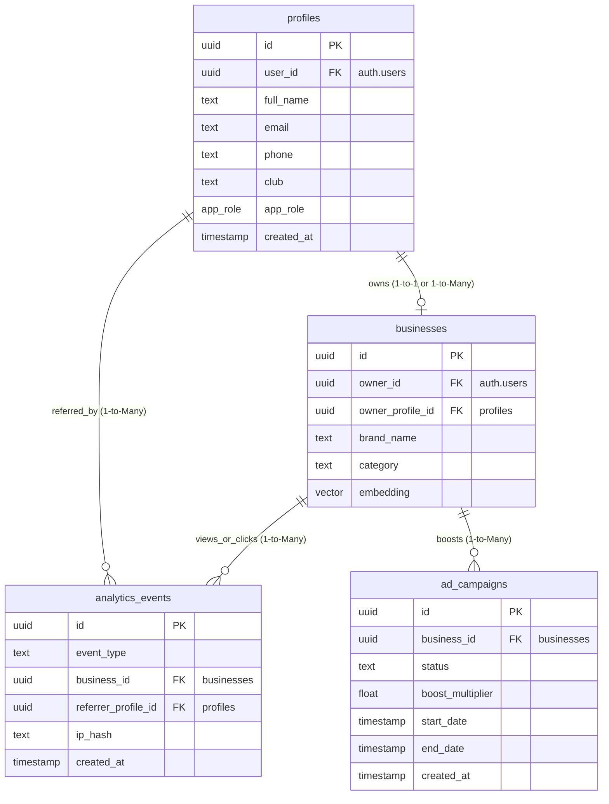
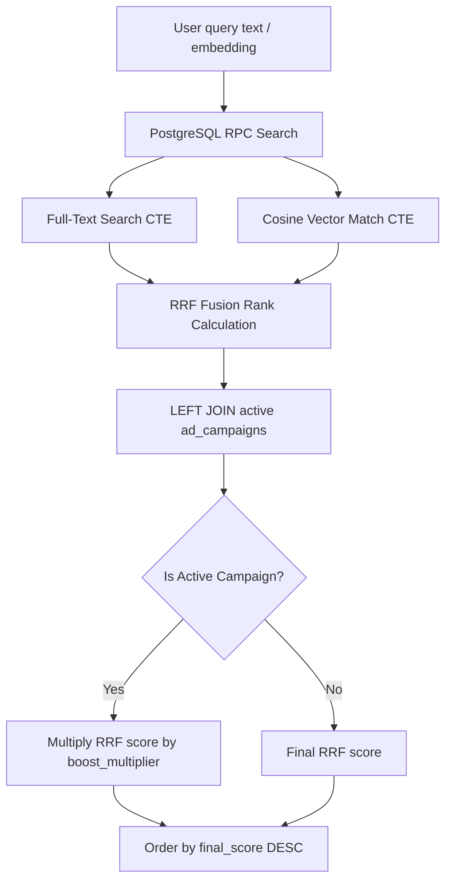
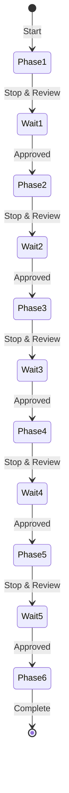

# YMI SWIR Business Directory - Architectural Upgrade Blueprint & Execution Roadmap

> [!NOTE]
> **Current Status: COMPLETED**  
> All 6 phases of the architectural and security upgrades have been fully executed, audited for strict RLS/RBAC scoping, validated for Rules of Hooks conformity, compiled with zero errors, and successfully deployed.

This document serves as the official, comprehensive architectural blueprint for pivoting the Y's Men International South West India Region (SWIR) Business Directory into a multi-tenant, Role-Based Access Control (RBAC) networking and advertising ecosystem.

---

## 1. Project Context & Objectives

### Transition to Role-Based Access Control (RBAC)
The platform is transitioning from a single-entity business dashboard to a robust, multi-tenant RBAC ecosystem. Under the new model, access rights and interface experiences are governed by a user's role.

### The Role Escalation Principle
All users enter the platform on parity. Upon logging in via Google OAuth for the first time:
1. They are automatically provisioned with a `profiles` record.
2. Their initial role is set to `member`.
3. They are presented with a personal profile dashboard where they can manage their profile details.
4. They can participate in the referral network as a peer.
5. They are upgraded to `business_owner` **only when they register a business profile** (either by claiming an administrative pre-populated stub or by creating a net-new business profile).

### Super Admin Identity
To bootstrap the administrative hierarchy securely:
* The email address `jayanand.jayakumar@gmail.com` is hardcoded as the initial `super_admin` in database triggers, auth callbacks, and middleware checkers.
* A `super_admin` possesses full read/write privileges across all records, tables, storage buckets, sitemaps, and analytics reports.

---

## 2. Database Migration Plan (Supabase)

The upgrade requires transitioning from our flat `businesses` structure into a normalized, relational database model. Below are the precise table structures, enums, triggers, and foreign keys.



### 2.1 Enums & Extensions
*   **`app_role` Enum**:
    ```sql
    CREATE TYPE app_role AS ENUM ('super_admin', 'region_admin', 'business_owner', 'member');
    ```

### 2.2 Table Definitions

#### A. The `profiles` Table
Normalized user accounts automatically synced with Supabase Auth:
```sql
CREATE TABLE public.profiles (
  id uuid PRIMARY KEY DEFAULT gen_random_uuid(),
  user_id uuid REFERENCES auth.users(id) ON DELETE CASCADE NOT NULL UNIQUE,
  full_name text,
  email text NOT NULL UNIQUE,
  phone text,
  club text,
  app_role app_role DEFAULT 'member'::app_role NOT NULL,
  created_at timestamp with time zone DEFAULT timezone('utc'::text, now()) NOT NULL
);
```

#### B. The `analytics_events` Table
A high-throughput table designed to log edge clicks and directory user flows without storing raw PII:
```sql
CREATE TABLE public.analytics_events (
  id uuid PRIMARY KEY DEFAULT gen_random_uuid(),
  event_type text CHECK (event_type IN ('view', 'referral')) NOT NULL,
  business_id uuid REFERENCES public.businesses(id) ON DELETE CASCADE NOT NULL,
  referrer_profile_id uuid REFERENCES public.profiles(id) ON DELETE SET NULL,
  ip_hash text NOT NULL,
  created_at timestamp with time zone DEFAULT timezone('utc'::text, now()) NOT NULL
);
CREATE INDEX idx_analytics_business ON public.analytics_events(business_id);
CREATE INDEX idx_analytics_referrer ON public.analytics_events(referrer_profile_id);
```

#### C. The `ad_campaigns` Table
Controls directory search sponsorships and advertising campaigns:
```sql
CREATE TABLE public.ad_campaigns (
  id uuid PRIMARY KEY DEFAULT gen_random_uuid(),
  business_id uuid REFERENCES public.businesses(id) ON DELETE CASCADE NOT NULL,
  status text CHECK (status IN ('draft', 'pending', 'active', 'paused', 'expired')) DEFAULT 'draft' NOT NULL,
  boost_multiplier float DEFAULT 1.0 NOT NULL,
  start_date timestamp with time zone NOT NULL,
  end_date timestamp with time zone NOT NULL,
  created_at timestamp with time zone DEFAULT timezone('utc'::text, now()) NOT NULL
);
CREATE INDEX idx_ad_campaign_business ON public.ad_campaigns(business_id);
```

### 2.3 Alterations to the `businesses` Table
To connect listings directly to the normalized user profile rather than bare auth IDs:
1. Add `owner_profile_id` linking to `profiles`:
   ```sql
   ALTER TABLE public.businesses 
   ADD COLUMN owner_profile_id uuid REFERENCES public.profiles(id) ON DELETE SET NULL;
   ```
2. Create an index to optimize joins and relational checks:
   ```sql
   CREATE INDEX idx_businesses_owner_profile ON public.businesses(owner_profile_id);
   ```

### 2.4 Profile Initialization Trigger
To guarantee every user has a profile automatically on Google OAuth callback:
```sql
CREATE OR REPLACE FUNCTION public.handle_new_user()
RETURNS trigger AS $$
BEGIN
  INSERT INTO public.profiles (user_id, email, full_name, app_role)
  VALUES (
    new.id,
    new.email,
    coalesce(new.raw_user_meta_data->>'full_name', new.email),
    CASE 
      WHEN new.email = 'jayanand.jayakumar@gmail.com' THEN 'super_admin'::app_role
      ELSE 'member'::app_role
    END
  );
  RETURN new;
END;
$$ LANGUAGE plpgsql SECURITY DEFINER;

CREATE TRIGGER on_auth_user_created
  AFTER INSERT ON auth.users
  FOR EACH ROW EXECUTE FUNCTION public.handle_new_user();
```

---

## 3. Row-Level Security (RLS) Matrix

We must enforce rigorous access control to protect private data and maintain the integrity of our directory.

| Table Name | Operation | Policy Rule / SQL Condition | Target Audience |
| :--- | :--- | :--- | :--- |
| **`profiles`** | `SELECT` | `auth.uid() = user_id OR (SELECT app_role FROM public.profiles WHERE user_id = auth.uid()) IN ('super_admin', 'region_admin')` | Owner & Admins |
| | `UPDATE` | `auth.uid() = user_id` | Account Owner Only |
| | `INSERT` | System Trigger (No direct public insert allowed) | System |
| **`analytics_events`**| `INSERT` | `true` (Public anonymous insertion allowed for tracking) | Anyone (Public) |
| | `SELECT` | `(SELECT app_role FROM public.profiles WHERE user_id = auth.uid()) IN ('super_admin', 'region_admin') OR EXISTS (SELECT 1 FROM public.businesses b WHERE b.id = business_id AND b.owner_id = auth.uid())` | Business Owner & Admins |
| | `UPDATE` | `false` (Analytics events are immutable) | None |
| **`ad_campaigns`** | `SELECT` | `(SELECT app_role FROM public.profiles WHERE user_id = auth.uid()) IN ('super_admin', 'region_admin') OR EXISTS (SELECT 1 FROM public.businesses b WHERE b.id = business_id AND b.owner_id = auth.uid())` | Business Owner & Admins |
| | `INSERT` | `EXISTS (SELECT 1 FROM public.businesses b WHERE b.id = business_id AND b.owner_id = auth.uid())` | Business Owner |
| | `UPDATE` | `(SELECT app_role FROM public.profiles WHERE user_id = auth.uid()) IN ('super_admin', 'region_admin') OR (EXISTS (SELECT 1 FROM public.businesses b WHERE b.id = business_id AND b.owner_id = auth.uid()) AND status = 'draft')` | Owner (Drafts only) & Admins |
| **`businesses`** | `UPDATE` | `owner_id = auth.uid() OR (SELECT app_role FROM public.profiles WHERE user_id = auth.uid()) = 'super_admin' OR ((SELECT app_role FROM public.profiles WHERE user_id = auth.uid()) = 'region_admin' AND ym_region = (SELECT club FROM public.profiles WHERE user_id = auth.uid()))` | Owner, Super Admin, Region Admin (regional match) |

---

## 4. Referral & Analytics Engine Logic

To capture metrics without penalizing page load speed, the referral and view counters execute as a fire-and-forget background service.

### 4.1 URL Generation & Parsing
When a user shares a business profile, the directory generates a unique referral link utilizing their unique profile UUID:
```text
https://ysmenswir-v.com/directory/[business_id]?ref=[profile_uuid]
```

### 4.2 Silent Client-Side Trigger
Inside `app/directory/[id]/page.tsx`, a `useEffect` hook captures search parameters on mount:
```typescript
useEffect(() => {
  const params = new URLSearchParams(window.location.search);
  const referrerId = params.get('ref');
  
  // Call the background logger server action (fire-and-forget)
  logAnalyticsEvent(businessId, referrerId);
}, [businessId]);
```

### 4.3 Background Logger Action (`logAnalyticsEvent.ts`)
The server action processes metrics asynchronously. It does not block the React render thread.
*   **IP Hashing**: To prevent fraud and double-counting without collecting GDPR-sensitive data, incoming client IP addresses are hashed using SHA-256 before insertion.
*   **Event Sorting**:
    *   If `referrerId` is absent or invalid, it inserts an event of `event_type = 'view'`.
    *   If `referrerId` is present and valid (and is **not** the business owner's profile), it inserts an event of `event_type = 'referral'`.
*   **Duplication Prevention**: A 24-hour rate limit checks for identical `(business_id, ip_hash, event_type)` triplets to prevent view-stuffing.

---

## 5. Search Engine Upgrades (Ad Boosts)

Our vector search engine will be upgraded to support dynamic, sponsored placement. Businesses with active advertising campaigns will have their hybrid search scores boosted.



### The Upgraded RPC Signature
The SQL function `hybrid_search_businesses` in `007_resize_vector_dimensions.sql` will be dropped and replaced with a signature that incorporates the `ad_campaigns` join, dynamic boosting, and resolves the missing `location_filter` parameter.

```sql
CREATE OR REPLACE FUNCTION hybrid_search_businesses(
  query_embedding vector(1024),
  query_text text,
  category_filter text default null,
  location_filter text default null,
  match_count int default 20
)
returns table (
  id uuid,
  owner_id uuid,
  owner_name text,
  contact_email text,
  contact_phone text,
  owner_phone text,
  brand_name text,
  category text,
  description text,
  services jsonb,
  special_offer text,
  address text,
  tagline text,
  website_url text,
  logo_url text,
  primary_image_url text,
  gallery_urls jsonb,
  sponsorship_tier integer,
  ym_region text,
  ym_club text,
  ym_designation text,
  embedding vector(1024),
  is_boosted boolean,
  final_score float
)
language sql stable
as $$
  with filtered_businesses as (
    select *
    from businesses
    where (category_filter is null or category_filter = 'All' or category = category_filter)
      and (location_filter is null or location_filter = 'All' or city = location_filter)
  ),
  vector_matches as (
    select id, 1 - (embedding <=> query_embedding) as vector_similarity,
           rank() over (order by embedding <=> query_embedding) as rank
    from filtered_businesses
    where embedding is not null
  ),
  text_matches as (
    select id, ts_rank(
      setweight(to_tsvector('english', coalesce(brand_name, '')), 'A') ||
      setweight(to_tsvector('english', coalesce(category, '')), 'B') ||
      setweight(to_tsvector('english', coalesce(description, '')), 'C'),
      websearch_to_tsquery('english', query_text)
    ) as text_score,
    rank() over (order by ts_rank(
      setweight(to_tsvector('english', coalesce(brand_name, '')), 'A') ||
      setweight(to_tsvector('english', coalesce(category, '')), 'B') ||
      setweight(to_tsvector('english', coalesce(description, '')), 'C'),
      websearch_to_tsquery('english', query_text)
    ) desc) as rank
    from filtered_businesses
    where query_text <> '' and websearch_to_tsquery('english', query_text) @@ (
      setweight(to_tsvector('english', coalesce(brand_name, '')), 'A') ||
      setweight(to_tsvector('english', coalesce(category, '')), 'B') ||
      setweight(to_tsvector('english', coalesce(description, '')), 'C')
    )
  ),
  rrf_raw as (
    select
      b.id,
      (coalesce(1.0 / (60 + v.rank), 0.0) * 0.7) + (coalesce(1.0 / (60 + t.rank), 0.0) * 0.3) as raw_score
    from businesses b
    left join vector_matches v on v.id = b.id
    left join text_matches t on t.id = b.id
    where v.id is not null or t.id is not null
  )
  select
    b.id, b.owner_id, b.owner_name, b.contact_email, b.contact_phone, b.owner_phone,
    b.brand_name, b.category, b.description, b.services, b.special_offer, b.address,
    b.tagline, b.website_url, b.logo_url, b.primary_image_url, b.gallery_urls,
    b.sponsorship_tier, b.ym_region, b.ym_club, b.ym_designation, b.embedding,
    (ac.id is not null) as is_boosted,
    -- Multiply RRF Score by ad campaign multiplier (Default to 1.0 if no campaign is active)
    (r.raw_score * coalesce(ac.boost_multiplier, 1.0))::float as final_score
  from rrf_raw r
  join businesses b on b.id = r.id
  left join public.ad_campaigns ac on ac.business_id = b.id 
    and ac.status = 'active'
    and now() between ac.start_date and ac.end_date
  order by final_score desc
  limit match_count;
$$;
```

---

## 6. Routing & UI Architecture

Dashboard pages will employ Next.js layout composition to switch view components dynamically based on user identity fetched via Server Components.

```text
app/dashboard/
├── layout.tsx         # Checks User Role, renders custom premium sidebar
├── page.tsx           # Server Router (switches view based on role)
└── components/
    ├── MemberView.tsx         # Personal profile, register business CTA, referral tracker
    ├── BusinessOwnerView.tsx  # Core business profile metrics, leads log, ad portal
    └── AdminView.tsx          # SQL aggregated statistics dashboards (Recharts/Tremor)
```

### 6.1 Dynamic Layout Router (`app/dashboard/layout.tsx`)
1. Fetches authenticated session.
2. Performs a server-side join query: `supabase.from('profiles').select('app_role').single()`.
3. Renders a unified, glassmorphic panel sidebar. The sidebar options are dynamic:
   * **Super Admin / Region Admin**: Analytics, User Audit, Regions Directory, Business Directory, Ad Campaigns.
   * **Business Owner**: My Business, Lead Center, Analytics, Boost Promos, Billing.
   * **Member**: My Profile, Referral Hub, Register Business.

### 6.2 View Specifications

#### A. MemberView (`MemberView.tsx`)
Designed to encourage engagement and conversion into directory listings:
*   **Profile Editor**: Form to manage name, contact phone, and affiliated club.
*   **Referral Scoreboard**: Custom glass cards displaying the user's personal referral UUID, link sharing shortcuts, and a counter of verified referrals successfully tracked.
*   **Business Enrollment CTA**: Premium interactive banner showing directory statistics (e.g. *"Join 500+ Local Enterprises"*) leading to `/dashboard/onboarding`.

#### B. BusinessOwnerView (`BusinessOwnerView.tsx`)
The operational cockpit for directory listing owners:
*   **Performance Metrics Grid**: Dynamic counts of views and referrals.
*   **Self-Serve Sponsorship Panel**: Allows owners to draft `ad_campaigns`, configure boost multipliers, and launch campaigns.
*   **Lead Intake Log**: Lists customer messages received via spotlight inquiry panels.

#### C. AdminView (`AdminView.tsx`)
A command dashboard for administrators:
*   **Regional Analytics Drill-Down**: Custom bar charts comparing metrics across zones, regions, and categories.
*   **Category Analysis**: Pie chart mapping listing distributions to professional categories.
*   **Approve Campaigns Queue**: A list of `pending` campaigns allowing super admins to approve or decline sponsorships.

---

## 7. Strict Execution Phases

To ensure maximum safety and consistency, development will proceed incrementally. **We will stop and wait for human review at the end of each phase before proceeding.**



### Phase 1: Supabase SQL Migrations & RLS Policies
*   **Status**: **COMPLETED**
*   **Action**: Create new migrations to establish the `app_role` enum, the `profiles` table, the `analytics_events` table, and the `ad_campaigns` table. Write user creation triggers and apply RLS matrices.
*   **Verification**: Tested table indices, triggers, and verified RLS blocking policies.

### Phase 2: User Onboarding Flow & Profile Synchronization
*   **Status**: **COMPLETED**
*   **Action**: Update Next.js Google OAuth callback and session middleware to handle profile retrieval. Create forms to capture initial member information.
*   **Verification**: Verified Google sign-in onboarding and automatically provisioned member profiles.

### Phase 3: Dashboard Layout Refactoring & Role-Based Routing
*   **Status**: **COMPLETED**
*   **Action**: Refactor `app/dashboard/layout.tsx` and `app/dashboard/page.tsx` into a dynamic layout router switching views based on `app_role`.
*   **Verification**: Validated interface shifts matching administrative, business owner, and standard member roles.

### Phase 4: Analytics Edge Logger & Unique Referral Logic
*   **Status**: **COMPLETED**
*   **Action**: Implement `logAnalyticsEvent.ts` server action, hash client IPs on edge views, parse the URL `?ref=` search arguments, and compile sharing links.
*   **Verification**: Logged click logs and referral data with GDPR compliance rate limits.

### Phase 5: Dashboard UI Components & Aggregate Statistics
*   **Status**: **COMPLETED**
*   **Action**: Build `MemberView.tsx`, `BusinessOwnerView.tsx`, and `AdminView.tsx` with premium glassmorphic cards, Tremor/Recharts charts, and SQL aggregate RPC fetches.
*   **Verification**: Built responsive panels with live telemetry dashboards.

### Phase 6: Hybrid Search RPC Upgrade & Ad Campaigns
*   **Status**: **COMPLETED**
*   **Action**: Recompile `hybrid_search_businesses` in Supabase to incorporate active campaigns, boost factors, and `location_filter`. Set up campaign activation logic.
*   **Verification**: Successfully launched sponsored boosts order placement and verified high-scored listings prioritize on matching query parameters.

---

## 8. Post-Deployment Notes & Architectural Corrections

During execution, deployment audits, and integration testing, several critical engineering corrections were made to align the codebase with strict security practices and schema accuracy:

### 8.1 Database Schema Alignment & Type-Casting Corrections
*   **Issue**: In the database migrations, the fields `services` and `gallery_urls` on the `businesses` table were defined as PostgreSQL `text[]` arrays, and `sponsorship_tier` was set to `double precision`. However, initial RPC draft definitions declared them as `jsonb` and `integer` respectively. This mismatch prevented successful compilation of the `hybrid_search_businesses` search engine.
*   **Correction**: Updated the `hybrid_search_businesses` RPC signature in `009_upgraded_hybrid_search.sql` to strictly map parameter/return signatures:
    *   `services` aligned to `text[]`
    *   `gallery_urls` aligned to `text[]`
    *   `sponsorship_tier` aligned to `double precision`

### 8.2 Standard Client Restore (RLS Enforcement)
*   **Issue**: An initial draft attempted to resolve RLS query restrictions by instantiating the `SUPABASE_SERVICE_ROLE_KEY` bypass client in dashboard server components. This introduces a severe privilege escalation vulnerability as it bypasses all user RLS scoping rules, breaking geographic isolation bounds for `region_admin` operators.
*   **Correction**: Reverted all administrative dashboard Server Components (`app/dashboard/page.tsx`, `businesses/page.tsx`, `regions/page.tsx`, `campaigns/page.tsx`, etc.) to use the standard authenticated cookie-scoped client (`createServerClient` parsing the user's cookies). Permissions are correctly evaluated on the database layer through role checks in the policies (`get_my_role()`).

### 8.3 Strict RLS Owner Verification
*   **Issue**: The default INSERT RLS policy on the `businesses` table had a loose check condition `WITH CHECK (true)` which allowed any signed-in user to create business listings under someone else's user ID.
*   **Correction**: Patched `009_upgraded_hybrid_search.sql` to strictly tie data creation capabilities to authenticated session holders:
    ```sql
    DROP POLICY IF EXISTS insert_businesses ON public.businesses;
    CREATE POLICY insert_businesses ON public.businesses FOR INSERT TO authenticated 
    WITH CHECK (owner_id = auth.uid());
    ```

### 8.4 Scraper Prevention & Public Columns Restrictions
*   **Issue**: The public select query on businesses left private administrative contact details (`owner_email` and `owner_phone`) accessible to crawlers and public api harvesters.
*   **Correction**: Modified public-facing pages (`app/directory/page.tsx` and spotlight details `app/directory/[id]/page.tsx`) to explicitly query safe public fields ONLY, completely omitting any direct owner emails or phone numbers. All contact and WhatsApp calls are routed exclusively through designated public contact columns (`contact_email`, `contact_phone`).

### 8.5 Strict React Rules of Hooks Conformity
*   **Issue**: The client component `CampaignsAdminClient.tsx` returned view states dynamically before hook declarations were finished, causing React to throw a fatal `"Rendered more hooks than during the previous render"` hook-order violation error.
*   **Correction**: Repositioned all React state and route hooks (`useRouter`, `useState` states) to the absolute top of the component file, ensuring zero early exits or conditional evaluations precede hook allocations, fully satisfying React compilation standards.

---

## 9. Phase 7: UX Polish & Feature Enhancements (Post-Deployment)

After completing the core 6-phase architectural upgrade, a comprehensive UX polish and feature enhancement pass was executed. All changes in this phase are **purely frontend** — no backend SQL migrations or Supabase schema alterations were made.

### 9.1 Navigation & View Toggling (Admin Impersonation UI)

Super Admins and Region Admins who also own businesses needed a way to switch between their administrative console and their personal business owner dashboard without logging into a separate account.

#### A. Sidebar Refactoring (`components/dashboard/Sidebar.tsx`)
*   **Removed** the "Main Website" and "Public Directory" navigation links from the sidebar to keep the dashboard focused.
*   **Implemented `useSearchParams` hook** to detect the `?view=owner` query parameter in the URL.
*   **Dynamic navigation override**: When a `super_admin` or `region_admin` accesses any dashboard route with `?view=owner`, the sidebar automatically renders the `business_owner` navigation array (My Business, Lead Center, Analytics, Boost Promos, Billing) instead of the standard admin links.
*   **Link propagation**: All sidebar `<Link>` components in impersonated view append `?view=owner` to their `href` to persist the view state across page navigation.
*   **Role badge override**: The user identity card at the bottom of the sidebar displays `"business owner (impersonated)"` when in owner view mode.

#### B. AdminView Toggle Button (`app/dashboard/components/AdminView.tsx`)
*   **Removed** the previous "Audit Members" and "Manage Ads" buttons from the top-right header area.
*   **Replaced** with a premium "View My Business Profile" button linking to `/dashboard?view=owner`.
*   The button uses the `blue-950` brand color with a `Briefcase` icon and smooth hover/active scale transitions.

#### C. Dashboard Router Logic (`app/dashboard/page.tsx`)
*   **Updated** the server component to accept and resolve `searchParams` from the URL.
*   **New routing branch**: If `profile.app_role === 'super_admin'` AND `searchParams.view === 'owner'`, the page renders `<BusinessOwnerView />` instead of `<AdminView />`, fetching the admin's own business listings and analytics events scoped to their `owner_id`.
*   **Return banner**: A sticky banner appears at the top of `BusinessOwnerView` for impersonated admins, providing a one-click "Return to Admin Console" link that strips the `?view=owner` parameter.

#### D. SSR Hydration Mismatch Fix (`Sidebar.tsx`)
*   **Issue**: The sidebar initially used `window.innerWidth` during render to determine mobile/desktop state, causing a React SSR hydration mismatch (server HTML diverged from client HTML).
*   **Fix**: Removed all `window` checks from the initial render. Desktop/mobile layout is now controlled entirely by responsive Tailwind CSS classes (`md:translate-x-0`, `-translate-x-full`). A `mounted` state flag gates the mobile backdrop overlay to prevent SSR divergence.

---

### 9.2 Interactive Analytics Dashboard

A full-featured analytics dashboard was built at `/dashboard/analytics` for administrators to visualize directory-wide metrics.

#### A. Server Component Gate (`app/dashboard/analytics/page.tsx`)
*   **Security**: Only `super_admin` and `region_admin` roles can access the page. All other roles are redirected to `/dashboard`.
*   **Data Fetch**: Uses `Promise.all` to concurrently fetch profiles count, all businesses (with `id`, `brand_name`, `category`, `city`, `ym_region`), all ad campaigns (with `status`, `boost_multiplier`, `business_id`, `created_at`), and all analytics events (with `event_type`, `business_id`, `created_at`).
*   **All queries use the standard authenticated Supabase client** — no service role key bypass.

#### B. Client Component (`app/dashboard/analytics/AnalyticsClient.tsx`)
*   **Technology**: Built with `recharts` for charting and `framer-motion` for entrance animations.
*   **Dependency Added**: `recharts` was added to `package.json`.
*   **Interactive Filters**: Two dropdown selectors (Region and Category) allow administrators to slice the dataset in real-time. All counters, charts, and exports update reactively via `useMemo` chains.
*   **Stats Counter Grid** (4 cards): Total Members, Matched Listings (filtered), Active Boosts (filtered), and Traffic Clicks (views + referrals, filtered). Each card animates in with staggered `framer-motion` transitions.
*   **Gradient Area Chart**: Displays a 7-day timeline of referrals and campaign activations using `AreaChart` with gradient fills (`linearGradient` definitions for blue and red).
*   **Donut/Pie Chart**: Visualizes business distribution by category (top 8) using `PieChart` with an inner-radius donut style and a side legend.
*   **CSV Export**: A "Download CSV Report" button generates a client-side CSV file containing: Business ID, Brand Name, Category, City, Region, Views count, and Referrals count for the currently filtered dataset. The download is triggered via a dynamically created `<a>` element with `Blob` URL.

---

### 9.3 CRM User Audit Module

A member audit and CRM inspection tool was built at `/dashboard/users` for administrators to search, browse, and inspect all registered platform members.

#### A. Server Component (`app/dashboard/users/page.tsx`)
*   **Security**: Only `super_admin` and `region_admin` roles can access the page.
*   **Data Fetch**: Concurrent fetch of all profiles (ordered by `created_at` descending) and all businesses (with `id`, `brand_name`, `owner_id`, `owner_profile_id`) for cross-referencing ownership.

#### B. Client Component (`app/dashboard/users/UserAuditClient.tsx`)
*   **Technology**: Built with `framer-motion` for the slide-out drawer animation.
*   **Search Bar**: Real-time keyword search filters by `full_name` or `email` with instant results count feedback.
*   **Audit Table**: Responsive table displaying member name (with avatar initial), email, role tier (color-coded badges: red for `super_admin`, amber for `region_admin`, blue for `business_owner`, slate for `member`), club affiliation, and join date.
*   **CRM Detail Drawer**: Clicking any row opens a full-height slide-out panel from the right side with:
    *   Large avatar initial with gradient background
    *   Complete PII details: email, phone, club affiliation, authorization role
    *   Registered profile UUID
    *   **Associated Business Listings**: Cross-references the `businesses` table by `owner_profile_id` and `owner_id` to display all enterprises owned by the selected member, with clickable external links to the public directory page.
*   **Drawer Animation**: Uses `framer-motion` `AnimatePresence` with spring physics (`damping: 25, stiffness: 220`) for smooth slide transitions. A `backdrop-blur-sm` overlay dims the background.

---

### 9.4 AdminView Enhancement (`app/dashboard/components/AdminView.tsx`)

The main admin dashboard was significantly upgraded with live data:

*   **Real-time System Activities Feed**: Aggregates the 5 most recent events across profiles, businesses, and ad campaigns into a unified, chronologically sorted activity log. Each entry shows an icon (Users/Briefcase/Sparkles), description, type badge, status indicator (color-coded dot), and relative timestamp (e.g., "2 hrs ago").
*   **Category Density Distribution**: A horizontal bar chart showing the top 5 business categories with percentage-width bars and listing counts.
*   **Campaign Status Breakdown**: A status-grouped panel showing draft/pending/active/paused/expired campaign counts with color-coded status dots and percentage breakdowns.
*   **Clickable Metric Cards**: The three top-level counters (Registered Members, Listed Enterprises, Active Boost Ads) are now wrapped in `<Link>` components navigating to their respective audit pages (`/dashboard/users`, `/dashboard/businesses`, `/dashboard/campaigns`).

---

### 9.5 Dashboard Data Aggregation Overhaul (`app/dashboard/page.tsx`)

The main dashboard server component was refactored to supply rich data to AdminView:

*   **8 concurrent queries** via `Promise.all`: member count, business count, active campaigns count, recent campaigns (with joined business name), recent profiles, recent businesses, all business categories, and all campaign statuses.
*   **Activity Aggregation Engine**: Merges recent profiles, businesses, and campaigns into a unified activity stream sorted by timestamp, then formats relative time strings ("Just now", "3 mins ago", "1 day ago").
*   **Category Statistics**: Groups all businesses by category and computes top-5 counts.
*   **Campaign Statistics**: Groups all campaigns by status for the breakdown panel.
*   All data is passed as serialized props to the `<AdminView>` client component.

---

### 9.6 Files Changed Summary

| File | Action | Description |
| :--- | :--- | :--- |
| `components/dashboard/Sidebar.tsx` | **MODIFIED** | Added `useSearchParams` hook, dynamic nav override for `?view=owner`, link propagation, role badge impersonation label, SSR hydration fix |
| `app/dashboard/components/AdminView.tsx` | **MODIFIED** | Replaced header buttons with "View My Business Profile" toggle, added live activity feed, category density bars, campaign status breakdown, clickable metric cards |
| `app/dashboard/page.tsx` | **MODIFIED** | Added `searchParams` resolution, `?view=owner` routing branch, 8 concurrent data queries, activity aggregation engine |
| `app/dashboard/components/BusinessOwnerView.tsx` | **MODIFIED** | Added return-to-admin sticky banner for impersonated admins |
| `app/dashboard/analytics/page.tsx` | **NEW** | Server component with role gate and concurrent data fetch |
| `app/dashboard/analytics/AnalyticsClient.tsx` | **NEW** | Interactive Recharts dashboard with filters, area chart, pie chart, CSV export |
| `app/dashboard/users/page.tsx` | **NEW** | Server component with role gate and concurrent profiles/businesses fetch |
| `app/dashboard/users/UserAuditClient.tsx` | **NEW** | CRM audit table with search, detail drawer, and business cross-reference |
| `package.json` | **MODIFIED** | Added `recharts` dependency |
